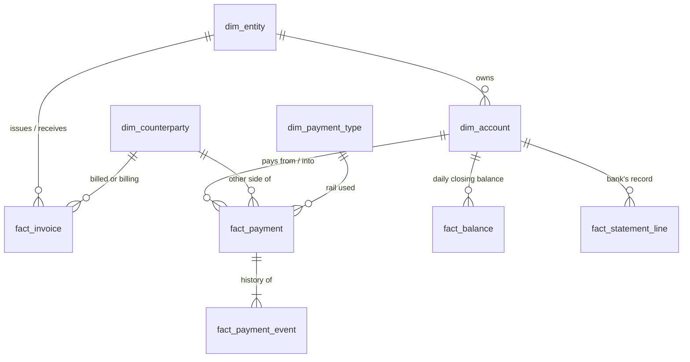

# Treasury Payments Analytics Platform

This is a portfolio project to learn, by building, what it is like to work in a Global Payments Solutions environment. 
It simulates the payments of a fictional multinational group, then builds a clean database (the data warehouse), nine treasury analyses, dashboards and a bank-style API on top of it.

> **All data is synthetic.** Entities, banks, BICs, counterparties and names are generated. No real client or employer data is used.

## The dataset at a glance

Picture one fictional company, **Group Treasury HQ in Singapore**, that owns ten other companies around the world. Every day those companies pay suppliers, get paid by customers, run payroll and move cash between themselves. The dataset is the record of all of that over 24 months: about **106,000 payments**, worth roughly **S$2.6 billion**.

| Term | Plain meaning | Example from the data |
|---|---|---|
| **11 entities** | The separate legal companies inside the group. Each has its own bank accounts, home currency and local rules. One (the HQ) also acts as the group's *in-house bank*, lending cash to the others. | `E03` **Shanghai Mfg**, a factory in China that earns and pays in yuan (CNY), and `E06` **Germany GmbH**, which pays in euros. |
| **About 50 accounts** (48) | Bank accounts held by those entities at fictional banks. Each has a currency, a target balance the treasury wants to keep, and sometimes an overdraft limit. Some are *pooled*: any surplus is swept to a header account every night. | `A004` is SG Operations' main SGD account at *Merlion Global Bank* (a made-up bank). |
| **6 currencies** | SGD, USD, EUR, GBP, CNY, INR. The group reports in SGD, so every payment also carries its SGD value. CNY and INR are *restricted*: cash can't move freely in or out of China and India. | A payment of 10,739.70 GBP is stored as S$18,108.73 at that day's exchange rate. |
| **Payment rails** | The "roads" money travels on. Which road you use decides how fast it arrives, what it costs and how often it fails. | See the three types below. |

**Domestic rails** move money *within one country or region*. They are cheap and reliable, but many
run in batches with a daily **cut-off time**: miss it and the payment waits until the next business day.
Examples: `GIRO` (Singapore, next day), `ACH` (US), `SEPA_CT` (Europe), `BACS` (UK), `NEFT` (India), `CNAPS` (China).

**Instant rails** settle in seconds, at any hour, but usually cap the amount.
Examples: `FAST` (Singapore, up to S$200,000), `SEPA_INST` (Europe).

**Cross-border rails** move money *between countries*, usually through `SWIFT`, where the payment
hops across one or more **correspondent banks**. It is slower, each hop can take a fee, and it fails
the most (about 3% vs under 1% for domestic). Example, from the `fact_payment` and `fact_payment_event` tables:

> Payment `P00008587`: SG Operations (Singapore) pays a UK supplier £10,739.70 over SWIFT. Created
> 01:09, approved, sent to the bank at 01:27, screened for sanctions, then three hops between banks,
> and settled at 02:29 UTC. Every one of those steps is a row in the event table.

Two more, for completeness: `CARD` (corporate card spend, settles in about 2 days) and
`BOOK_TRANSFER` (between accounts at the same bank, instant).

**How the core tables connect.** Each of our companies owns accounts. Every payment runs between
one of our accounts and a counterparty, and it carries a step-by-step event history. Invoices say
what *should* be paid, payments say what *was* paid, and bank statements are the bank's own record.
Linking those three is the reconciliation problem, so there is deliberately no direct join between them.



The full diagram, with key columns and the reasoning behind each link, is in
[docs/data-model.md](docs/data-model.md).

**Preview the data without running anything:** see the [dataset card](docs/dataset/dataset-card.md)
(summary statistics, every column explained, one example record per table) and the
[sample CSVs](docs/dataset/samples/), which GitHub shows as tables.

## Where the data lives

Every build writes four folders, into `data_small/` (small profile) or `data/` (full profile):

| Folder | What it holds | Correct? | Who reads it |
|---|---|---|---|
| `raw/` | Parquet files as the source systems would send them, one per month per feed. The payments files contain deliberately planted defects. | **No**, on purpose | The cleaning pipeline (its input) |
| `clean/` | `treasury.sqlite`, the clean database (in industry terms, the *data warehouse*). The simulator writes the correct version of every table here. | **Yes** | SQL analyses, dashboards, API |
| `answer_key/` | What the simulator planted: which rows are defective, which payments are anomalies, which invoice each payment paid. Also called *ground truth*. | Yes. It lists the answers | Only scoring code, **never** analysis code |
| `exports/` | Excel and CSV copies of `clean/`, for browsing. | Yes | You |

## Why this project exists

I wanted hands-on practice with the problems a payments and treasury team deals with every
day: where money moves, why payments fail, how fast they settle, where cash sits idle, how
FX exposure builds up, and which transactions look wrong.

**The problem: there is no public dataset that fits.** Real payment data is confidential,
and the public datasets I found don't cover what I need (for example, PaySim and
credit-card fraud sets have fraud labels but no rails, cut-offs, correspondent hops,
bank statements, balances or intercompany flows). What I need is a linked set of payment
lifecycle events, bank statements, ledger balances, invoices and FX, with known answers to
check my analysis against.

**So I built the data first.** The simulator (built with claude) models how the business works (invoices,
payroll, tax, intercompany funding), pushes that through payment rails with realistic
timing, cut-offs, failures and fees, and posts it to a ledger. Then it deliberately plants
the patterns each analysis should find (a slow corridor, a legacy-file channel with worse
straight-through processing, repeat-offender suppliers, an entity that drains into
overdraft while another sits on idle cash) and records the answer key separately in
`data/answer_key/`. 

Data-quality defects go only into the raw data, so the cleaning pipeline has real work to do. That gives me an answer key: I can check whether my SQL and models find what I planted.

## Documentation trail

This repo is documented as I go, so the reasoning is visible, not just the result.

- [docs/journal/](docs/journal/) has dated entries: what I did, why, what went wrong, what I changed.
- [docs/data-model.md](docs/data-model.md) is the ER diagram: how the tables join, and which links are missing on purpose.
- [docs/dataset-design-review.md](docs/dataset-design-review.md) maps each analysis to the fields it needs.
- [docs/architecture.md](docs/architecture.md) describes the system design.
- Commit history is kept small and descriptive, one step per commit.

## Quick start

```bash
python3 -m venv .venv && source .venv/bin/activate
pip install -e ".[dev,api]"

# Small profile (recommended): ~106k payments, builds in ~20s, CSV/Excel friendly
treasury-sim --config config/simulation.small.yaml backfill
# ...also writes data_small/exports/treasury_dataset.xlsx (one sheet per table) and csv/,
# and refreshes docs/dataset/. Both rebuild automatically after every backfill and while streaming.
treasury-sim --config config/simulation.small.yaml export-all    # rebuild the exports on demand

# Full profile: ~850k payments, ~2 min
treasury-sim backfill             # 24 months of history -> data/clean/treasury.sqlite
treasury-sim stream --days 7      # then keep going live: 5 simulated minutes per real second
treasury-sim export-camt053 --account A001 --date 2026-09-15   # ISO 20022 bank statement XML
pytest                            # add -m "not contract" to skip the ~1 min full-size data checks
```

# Step 1: Exploring the dirty data (done, cleaning pipeline skipped)
The simulator deliberately created 3 things.
1. It created "Clean", which includes
2. It created "Raw", which includes all the data rows + defects. 
3. It created "answer_key", which highlights the defects

I did not build the cleaning pipeline. This project is about payments analytics, not data cleaning, so I stop at finding the defects and start the analysis from "Clean".

I explored "Raw" first in `notebooks/01_explore_raw_data.ipynb`, and found 6 defects:

| Defect | Rows | Fix |
|---|---|---|
| Duplicate rows (a re-sent file) | 415 | Drop the copy |
| Currency code misspelled (`usd`, `US$`) | 585 | Map to the real code |
| Country name misspelled (`China`, `UK`) | 1,033 | Map to the real code |
| Negative amount | 293 | Take the absolute value |
| `settled_ts` before `initiated_ts` | 536 | Use the time of the SETTLED event |
| Missing `purpose_code` | 3,158 | Can't fix, keep the row and flag it |

My counts matched the "answer_key" on all six. The unfinished pipeline code in `src/treasury/pipeline/` is parked and not needed for anything else.

Now that I know what the defects look like, we move on to the SQL analysis, which uses the "Clean" database

# Step 2: SQL Analysis
This is where the project starts from now. The queries in `sql/analyses/` run on `data_small/clean/treasury.sqlite`.

All the payment data lives in the databases. Therefore, I use SQL to query the database instead of using pandas to manipulate. The data is also relational, spans across multiple tables, needs joins, and is extremely huge. SQL is used over pandas to aggregate the data, perform GROUPBY etc. Pandas is more suited when the file is flat and for exploring/modelling.

## Analysis 1: Money Movement
This analysis asks "Where is the money moving?". It asks which entities, countries, and currencies carry the most volume, and at what scale.

We have to first think about what makes or counts as a money movement.
1. Intercompany or internal transfers are not considered "money moving" for the group
2. Money only moves when status is completed/delayed, not pending/returned/rejected

### Query #1 - Set up the main query
```sql
WITH base AS (
    SELECT p.payment_id,
           e.entity_id,
           e.name            AS entity_name,
           p.direction,
           p.sender_country,
           p.receiver_country,
           p.currency_code,
           p.amount_sgd,
           date(p.initiated_ts) AS pay_date
    FROM fact_payment p
    JOIN dim_account a ON a.account_id = p.account_id
    JOIN dim_entity  e ON e.entity_id  = a.entity_id
    WHERE p.is_intercompany = 0
      AND p.status IN ('completed', 'delayed')
)
SELECT * FROM base LIMIT 20;
```

This query joins the payment data with relevant dimensions account and entity. We join payment to account on "account_id", and join the account to the entity on "entity_id".

With these joins, this sets the foundation and we can filter for which entities, country etc are NOT intercompany and completed/delayed.

### Query 2 - Find which currencies have the highest value
```sql
WITH base AS (
    SELECT p.payment_id,
           e.entity_id,
           e.name            AS entity_name,
           p.direction,
           p.sender_country,
           p.receiver_country,
           p.currency_code,
           p.amount_sgd,
           date(p.initiated_ts) AS pay_date
    FROM fact_payment p
    JOIN dim_account a ON a.account_id = p.account_id
    JOIN dim_entity  e ON e.entity_id  = a.entity_id
    WHERE p.is_intercompany = 0
      AND p.status IN ('completed', 'delayed')
)
SELECT currency_code,
COUNT(*) AS number_of_payments,
ROUND(SUM(amount_sgd)/1e6, 1) AS value_sgd_m
FROM base GROUP BY currency_code ORDER BY value_sgd_m DESC;
```

| currency_code | n_payments | value_sgd_m |
|---|---|---|
| USD | 28911 | 1027.6 |
| EUR | 25487 | 804.4 |
| CNY | 25299 | 779.5 |
| SGD | 10442 | 253.3 |
| GBP | 5914 | 144.0 |
| INR | 5087 | 125.6 |

USD has the largest value, and number of payments

### Query 3 - Find which are the top cross-border corridors
A cross-border corridor is essentially a route money takes from one country to another (sender country → receiver country). SG paying CN is a cross-border corridor.

This matters as:
1. Each corridor has its own cost, speed, and failure rate
2. Corridors show where the group's FX exposure and money flow are concentrated

```sql
WITH base AS (
    SELECT p.payment_id,
           e.entity_id,
           e.name            AS entity_name,
           p.direction,
           p.sender_country,
           p.receiver_country,
           p.currency_code,
           p.amount_sgd,
           date(p.initiated_ts) AS pay_date
    FROM fact_payment p
    JOIN dim_account a ON a.account_id = p.account_id
    JOIN dim_entity  e ON e.entity_id  = a.entity_id
    WHERE p.is_intercompany = 0
      AND p.status IN ('completed', 'delayed')
)
SELECT sender_country || ' -> ' || receiver_country AS corridor,
COUNT(*) AS n_payments,
ROUND(SUM(amount_sgd) / 1e6, 1) AS value_sgd_m
FROM base
WHERE sender_country <> receiver_country
GROUP BY corridor
ORDER BY value_sgd_m desc
LIMIT 15;
```

| corridor | n_payments | value_sgd_m |
|---|---|---|
| SG -> CN | 5724 | 125.1 |
| DE -> US | 1702 | 85.8 |
| US -> CN | 3674 | 82.4 |
| DE -> SG | 1621 | 78.4 |
| CN -> DE | 1759 | 56.4 |
| US -> DE | 2135 | 49.1 |
| CN -> US | 1054 | 46.4 |
| DE -> GB | 1153 | 44.3 |
| NL -> DE | 2215 | 41.1 |
| DE -> CN | 1151 | 38.3 |
| VN -> CN | 647 | 31.9 |
| SG -> DE | 924 | 29.8 |
| CN -> SG | 771 | 29.3 |
| MY -> SG | 510 | 28.6 |
| CN -> GB | 761 | 28.1 |

The Singapore -> China corridor is the busiest and carries the highest value

### Query 4 - Find inflows vs outflows per entity
With this query, we can find which entities are net receivers and which are net payers

```sql
WITH base AS (
    SELECT p.payment_id,
           e.entity_id,
           e.name            AS entity_name,
           p.direction,
           p.sender_country,
           p.receiver_country,
           p.currency_code,
           p.amount_sgd,
           date(p.initiated_ts) AS pay_date
    FROM fact_payment p
    JOIN dim_account a ON a.account_id = p.account_id
    JOIN dim_entity  e ON e.entity_id  = a.entity_id
    WHERE p.is_intercompany = 0
      AND p.status IN ('completed', 'delayed')
)
SELECT entity_id,
       SUM(CASE WHEN direction = 'IN' THEN amount_sgd ELSE 0 END) AS inflow_sgd,
       SUM(CASE WHEN direction = 'OUT' THEN amount_sgd ELSE 0 END) AS outflow_sgd,
       SUM(CASE WHEN direction = 'IN' THEN amount_sgd
                WHEN direction = 'OUT' THEN -amount_sgd
                ELSE 0 END) AS net_inflow
FROM base
GROUP BY entity_id
ORDER BY net_inflow DESC;
```

| entity_id | inflow_sgd | outflow_sgd | net_inflow |
|---|---|---|---|
| E05 | 158434552.16 | 55354757.76 | 103079794.4 |
| E02 | 224388831.35 | 161625047.1 | 62763784.25 |
| E10 | 250333960.85 | 192956297.26 | 57377663.59 |
| E11 | 120381598.46 | 81874885.58 | 38506712.88 |
| E08 | 144816275.01 | 108942968.67 | 35873306.34 |
| E09 | 143750133.28 | 113440934.64 | 30309198.64 |
| E07 | 88348314.66 | 66627555.71 | 21720758.95 |
| E01 | 39705819.2 | 36963092.38 | 2742726.82 |
| E04 | 156372992.82 | 154462487.54 | 1910505.28 |
| E03 | 211730508.9 | 215603869.12 | -3873360.22 |
| E06 | 166528987.38 | 241711795.39 | -75182808.01 |

E05 (India Services) is the biggest net receiver, and E06 (Germany GmbH) is the biggest net payer.

### Query 5 - Monthly trend
We can see the total value of payments moving by month

```sql
WITH base AS (
    SELECT p.payment_id,
           e.entity_id,
           e.name            AS entity_name,
           p.direction,
           p.sender_country,
           p.receiver_country,
           p.currency_code,
           p.amount_sgd,
           date(p.initiated_ts) AS pay_date
    FROM fact_payment p
    JOIN dim_account a ON a.account_id = p.account_id
    JOIN dim_entity  e ON e.entity_id  = a.entity_id
    WHERE p.is_intercompany = 0
      AND p.status IN ('completed', 'delayed')
)
SELECT STRFTIME('%Y-%m',pay_date) AS month,
       COUNT(*) AS n_payments,
       ROUND(sum(amount_sgd) / 1e6, 1) AS value_sgd_m,
       ROUND(SUM(CASE WHEN direction = 'IN'  THEN amount_sgd ELSE 0 END)/ 1e6, 1) AS inflow_sgd,
       ROUND(SUM(CASE WHEN direction = 'OUT' THEN amount_sgd ELSE 0 END) / 1e6 ,1) AS outflow_sgd,
       ROUND(SUM(CASE WHEN direction = 'IN' THEN amount_sgd
                   WHEN direction = 'OUT' THEN - amount_sgd
                   ELSE 0 END) / 1e6, 1) AS net_inflow
 FROM base
 GROUP BY month
 ORDER BY month ASC;
```

| month | n_payments | value_sgd_m | inflow_sgd | outflow_sgd | net_inflow |
|---|---|---|---|---|---|
| 2024-10 | 3967 | 102.4 | 53.9 | 48.5 | 5.3 |
| 2024-11 | 3719 | 113.1 | 61.7 | 51.4 | 10.4 |
| 2024-12 | 4026 | 125.2 | 69.2 | 56.1 | 13.1 |
| 2025-01 | 4053 | 127.7 | 65.0 | 62.7 | 2.3 |
| 2025-02 | 3750 | 107.6 | 58.2 | 49.4 | 8.7 |
| 2025-03 | 3964 | 112.1 | 62.0 | 50.2 | 11.8 |
| 2025-04 | 4314 | 130.3 | 67.0 | 63.3 | 3.8 |
| 2025-05 | 3886 | 112.0 | 57.9 | 54.1 | 3.8 |
| 2025-06 | 3995 | 115.4 | 64.5 | 50.9 | 13.6 |
| 2025-07 | 4590 | 135.3 | 67.1 | 68.2 | -1.1 |
| 2025-08 | 3995 | 120.7 | 65.8 | 54.9 | 10.9 |
| 2025-09 | 4556 | 146.7 | 81.0 | 65.7 | 15.4 |
| 2025-10 | 4391 | 138.3 | 72.3 | 66.0 | 6.3 |
| 2025-11 | 3826 | 114.4 | 59.1 | 55.3 | 3.8 |
| 2025-12 | 4722 | 156.8 | 85.1 | 71.6 | 13.5 |
| 2026-01 | 4063 | 123.8 | 74.4 | 49.4 | 25.0 |
| 2026-02 | 3798 | 119.9 | 62.8 | 57.1 | 5.8 |
| 2026-03 | 4564 | 147.4 | 85.0 | 62.5 | 22.5 |
| 2026-04 | 4441 | 143.5 | 77.6 | 65.9 | 11.7 |
| 2026-05 | 4041 | 133.3 | 75.1 | 58.2 | 17.0 |
| 2026-06 | 4684 | 151.9 | 92.8 | 59.1 | 33.7 |
| 2026-07 | 4688 | 149.4 | 78.8 | 70.6 | 8.2 |
| 2026-08 | 4575 | 151.4 | 83.7 | 67.7 | 16.0 |
| 2026-09 | 4532 | 155.6 | 84.8 | 70.9 | 13.9 |

Both inflows and outflows trend upwards over the 24 months, and net inflow is positive in every month except 2025-07.

### Query 6 - Saving as a view for the dashboard
All of our queries above are important, and we want a way to save each finished query as a view. The dashboard will read the view instead of repeating the SQL

Add these lines:
```sql
DROP VIEW IF EXISTS vw_01_currency;
CREATE VIEW vw_01_currency AS
```
in front of every working query we want to show 


## Analysis 2: Cross Border Payments
The first analysis focused on which entities, countries, and currencies carry the most volume. This analysis zooms into the specific payments that cross a border. It measures how well money moves across borders: how long it takes to settle and how often it fails.

- Analysis 1 answers "how much": SG -> CN is the biggest corridor, at S$125m.
- Analysis 2 answers "how well": SG -> CN takes about 39 hours to settle on average and fails 1.4% of the time.

### Query 1 - Cross-border payments with settlement time in hours and a failure flag
This query is similar to Query 3 in Analysis 1. We filter out payments within the same country, and payments where the status is "pending" as these payments distort the metrics we are trying to find. This query lists the 20 payments with the longest hours to settle, to get a first feel for which corridors are slow.

```sql
WITH xb AS (
    SELECT p.payment_id,
           p.sender_country || ' -> ' || p.receiver_country AS corridor,
           t.rail,
           p.amount_sgd,
           p.status,
           CASE WHEN p.status IN ('rejected', 'returned') THEN 1 ELSE 0 END AS is_failed,
           CASE WHEN p.status IN ('completed', 'delayed')
                THEN (julianday(p.settled_ts) - julianday(p.initiated_ts)) * 24 END AS hours_to_settle
    FROM fact_payment p
    JOIN dim_payment_type t ON t.type_id = p.type_id
    WHERE p.is_intercompany = 0
      AND p.sender_country <> p.receiver_country
      AND p.status <> 'pending'
)
SELECT * FROM xb
ORDER BY hours_to_settle DESC
LIMIT 20;
```

| payment_id | corridor | rail | amount_sgd | status | is_failed | hours_to_settle |
|---|---|---|---|---|---|---|
| P00076889 | CN -> US | CARD | 462.72 | completed | 0 | 305.3 |
| P00023749 | CN -> DE | CARD | 63.58 | completed | 0 | 305.1 |
| P00077361 | CN -> SG | CARD | 83.97 | completed | 0 | 293.3 |
| P00023709 | CN -> IN | CARD | 445.07 | completed | 0 | 288.1 |
| P00077371 | CN -> NL | CARD | 149.05 | completed | 0 | 287.7 |
| P00023731 | CN -> DE | CARD | 157.56 | completed | 0 | 284.0 |
| P00077169 | CN -> VN | CARD | 183.71 | completed | 0 | 283.0 |
| P00077209 | CN -> DE | CARD | 2870.83 | completed | 0 | 280.3 |
| P00077264 | CN -> JP | CARD | 34.42 | completed | 0 | 278.9 |
| P00023769 | CN -> AE | CARD | 205.77 | completed | 0 | 278.6 |
| P00077454 | GB -> CN | SWIFT_XBORDER | 18902.37 | delayed | 0 | 272.2 |
| P00077391 | VN -> CN | SWIFT_XBORDER | 20711.44 | completed | 0 | 258.75 |
| P00077404 | IN -> CN | SWIFT_XBORDER | 32567.78 | completed | 0 | 256.3 |
| P00057643 | CN -> DE | CARD | 88.68 | completed | 0 | 255.6 |
| P00077481 | GB -> CN | SWIFT_XBORDER | 18150 | completed | 0 | 248.2 |
| P00077357 | US -> VN | SWIFT_XBORDER | 65096.63 | delayed | 0 | 245.5 |
| P00057456 | CN -> DE | CARD | 170.51 | completed | 0 | 243.7 |
| P00023828 | CN -> IN | CARD | 69.27 | completed | 0 | 240.7 |
| P00057496 | CN -> JP | CARD | 1613.56 | completed | 0 | 239.2 |
| P00057507 | CN -> US | CARD | 73.02 | completed | 0 | 238.8 |

From eyeballing the top 20 results, corridors where CN is the sender have the largest hours to settle, and most of these rows are CARD payments. We can investigate further with queries below.

### Query 2 - Average settlement hour and failure % per corridor
This query groups by each corridor and computes the average hour it takes for a payment to settle, alongside the failure rate of each corridor (when status = returned or rejected).

```sql
WITH xb AS (
    SELECT p.sender_country || ' -> ' || p.receiver_country AS corridor,
           p.amount_sgd,
           (julianday(p.settled_ts) - julianday(p.initiated_ts)) * 24 AS hours_to_settle,
           CASE WHEN p.status IN ('rejected', 'returned') THEN 1 ELSE 0 END AS is_failed
    FROM fact_payment p
    WHERE p.is_intercompany = 0
      AND p.sender_country <> p.receiver_country
      AND p.status <> 'pending'
)
SELECT corridor,
       COUNT(*) AS n_payments,
       ROUND(sum(amount_sgd) / 1e6, 1) AS value_sgd_m,
       ROUND(AVG(hours_to_settle), 1) AS avg_hours,
       ROUND(100.0 * AVG(hours_to_settle > 48), 1) AS pct_over_48h,
       ROUND(100.0 * SUM(is_failed) / COUNT(*), 1) AS failure_pct
FROM xb
GROUP BY corridor
HAVING n_payments >= 200
ORDER BY avg_hours DESC;
```

| corridor | n_payments | value_sgd_m | avg_hours | pct_over_48h | failure_pct |
|---|---|---|---|---|---|
| SG -> VN | 244 | 4.4 | 55.5 | 38.7 | 2.9 |
| IN -> VN | 289 | 4.1 | 48.1 | 35.8 | 3.8 |
| GB -> CN | 1119 | 22.0 | 46.8 | 30.3 | 2.4 |
| US -> IN | 958 | 21.3 | 44.9 | 33.0 | 6.4 |
| NL -> CN | 910 | 23.5 | 44.3 | 28.3 | 1.5 |
| CN -> JP | 305 | 6.2 | 43.4 | 28.1 | 2.3 |
| US -> DE | 2173 | 50.3 | 43.3 | 29.7 | 1.7 |
| DE -> VN | 273 | 7.0 | 42.9 | 26.5 | 3.7 |
| CN -> AU | 341 | 8.3 | 42.9 | 28.6 | 1.5 |
| US -> XB | 1078 | 19.6 | 42.8 | 28.4 | 3.4 |
| US -> CN | 3711 | 84.0 | 41.4 | 29.4 | 1.0 |
| IN -> CN | 486 | 12.7 | 41.4 | 29.9 | 0.8 |
| US -> ID | 769 | 19.4 | 40.9 | 28.9 | 0.4 |
| IN -> DE | 652 | 12.4 | 40.3 | 31.2 | 1.4 |
| DE -> CN | 1169 | 39.0 | 39.9 | 24.1 | 1.5 |
| CN -> XB | 338 | 7.4 | 39.8 | 26.6 | 6.2 |
| SG -> CN | 5806 | 128.3 | 39.3 | 28.4 | 1.4 |
| GB -> IN | 256 | 5.1 | 39.1 | 24.9 | 1.2 |
| GB -> XB | 251 | 5.5 | 38.9 | 28.3 | 3.2 |
| GB -> SG | 253 | 6.4 | 38.6 | 23.0 | 2.4 |
| NL -> AE | 253 | 6.8 | 38.0 | 25.2 | 1.2 |
| NL -> SG | 258 | 8.2 | 37.9 | 23.7 | 2.3 |
| US -> AU | 711 | 14.1 | 36.9 | 27.1 | 1.0 |
| NL -> DE | 2252 | 42.0 | 36.6 | 26.1 | 1.6 |
| US -> SG | 620 | 17.0 | 35.0 | 26.7 | 1.5 |
| US -> GB | 697 | 19.4 | 34.3 | 23.8 | 1.3 |
| IN -> SG | 301 | 10.3 | 33.4 | 22.0 | 2.3 |
| CN -> DE | 1800 | 58.2 | 33.3 | 22.0 | 2.3 |
| GB -> DE | 863 | 21.8 | 33.1 | 21.5 | 2.1 |
| US -> NL | 446 | 18.5 | 32.9 | 21.0 | 1.8 |
| DE -> IN | 441 | 15.6 | 31.6 | 20.2 | 1.6 |
| DE -> XB | 261 | 7.6 | 31.1 | 19.0 | 3.4 |
| NL -> XB | 245 | 4.8 | 30.3 | 19.0 | 3.7 |
| NL -> GB | 378 | 9.9 | 30.3 | 22.7 | 1.1 |
| SG -> US | 380 | 20.7 | 26.8 | 16.7 | 2.6 |
| SG -> DE | 941 | 31.8 | 26.6 | 18.1 | 1.8 |
| CN -> SG | 785 | 29.7 | 26.4 | 17.9 | 1.8 |
| DE -> SG | 1657 | 80.5 | 25.4 | 15.2 | 2.2 |
| CN -> US | 1075 | 48.3 | 25.2 | 12.5 | 2.0 |
| SG -> IN | 257 | 8.3 | 22.5 | 15.5 | 2.3 |
| IN -> GB | 266 | 8.6 | 22.5 | 15.5 | 0.8 |
| GB -> US | 256 | 9.9 | 22.3 | 9.4 | 0.8 |
| NL -> US | 473 | 18.8 | 22.0 | 14.2 | 1.1 |
| CN -> GB | 787 | 29.1 | 22.0 | 14.6 | 3.3 |
| CN -> IN | 608 | 24.1 | 21.9 | 13.5 | 1.2 |
| DE -> GB | 1179 | 45.4 | 20.6 | 12.4 | 2.2 |
| GB -> NL | 216 | 7.7 | 19.8 | 14.0 | 0.5 |
| AE -> SG | 239 | 10.8 | 19.3 | 9.4 | 2.1 |
| SG -> GB | 484 | 21.9 | 19.0 | 13.4 | 1.0 |
| MY -> CN | 414 | 19.8 | 17.9 | 9.0 | 1.0 |
| IN -> US | 221 | 10.2 | 16.9 | 7.8 | 1.4 |
| MY -> US | 410 | 18.4 | 16.8 | 6.1 | 1.2 |
| VN -> US | 453 | 20.4 | 15.6 | 5.0 | 2.0 |
| CN -> NL | 525 | 27.4 | 15.5 | 8.3 | 1.0 |
| VN -> CN | 660 | 33.4 | 15.2 | 8.0 | 2.0 |
| SG -> NL | 214 | 10.0 | 14.3 | 7.0 | 0.0 |
| DE -> NL | 336 | 13.0 | 14.1 | 7.0 | 2.1 |
| VN -> SG | 308 | 15.7 | 13.5 | 6.2 | 1.0 |
| AE -> US | 211 | 9.6 | 11.4 | 5.3 | 1.4 |
| DE -> US | 1728 | 86.8 | 10.9 | 4.5 | 1.5 |
| VN -> DE | 410 | 21.6 | 10.5 | 5.0 | 2.9 |
| MY -> SG | 521 | 29.0 | 9.9 | 3.7 | 2.1 |
| ID -> NL | 222 | 12.1 | 9.9 | 4.7 | 3.2 |
| XB -> US | 254 | 16.6 | 9.6 | 2.8 | 3.1 |
| MY -> NL | 284 | 15.6 | 8.8 | 2.5 | 1.8 |
| VN -> NL | 313 | 14.0 | 8.3 | 3.9 | 0.6 |
| MY -> DE | 292 | 14.5 | 8.1 | 2.1 | 1.0 |
| VN -> GB | 206 | 9.0 | 8.0 | 3.4 | 0.5 |

For settled payments (rejected and returned payments have NULL), SG -> VN, IN -> VN, and GB -> CN are the 3 corridors with the longest average hours for time taken to settle. We can also see that for these 3 corridors, the percent of payments that take longer than 48 hours is also significantly high. 

By changing the SQL query to order by failure_pct, we can see that the corridors US -> IN, CN -> XB, and IN -> VN have the highest failure percentages.

### Query 3 - Average settlement hour and failure % per rail
This query is similar to Query 2, except instead of grouping by the corridor, we group by the rail instead. To do this, we need to add a LEFT JOIN to the CTE function

```sql
WITH xb AS (
    SELECT p.sender_country || ' -> ' || p.receiver_country AS corridor,
           pt.rail AS rail,
           p.amount_sgd,
           (julianday(p.settled_ts) - julianday(p.initiated_ts)) * 24 AS hours_to_settle,
           CASE WHEN p.status IN ('rejected', 'returned') THEN 1 ELSE 0 END AS is_failed
    FROM fact_payment p
    LEFT JOIN dim_payment_type pt ON p.type_id = pt.type_id
    WHERE p.is_intercompany = 0
      AND p.sender_country <> p.receiver_country
      AND p.status <> 'pending'
)
SELECT rail,
       COUNT(*) AS n_payments,
       ROUND(sum(amount_sgd) / 1e6, 1) AS value_sgd_m,
       ROUND(AVG(hours_to_settle), 1) AS avg_hours,
       ROUND(100.0 * AVG(hours_to_settle > 48), 1) AS pct_over_48h,
       ROUND(100.0 * SUM(is_failed) / COUNT(*), 1) AS failure_pct
FROM xb
GROUP BY rail
HAVING n_payments >= 200
ORDER BY avg_hours DESC;
```

| rail | n_payments | value_sgd_m | avg_hours | pct_over_48h | failure_pct |
|---|---|---|---|---|---|
| CARD | 18798 | 6.0 | 65.4 | 49.0 | 0.4 |
| SWIFT_XBORDER | 36409 | 1745.1 | 14.0 | 6.4 | 2.6 |

We can see that there is a trade off for using each payment rail. For CARD payments, the average total value per transaction is small as compared to SWIFT_XBORDER, but faces a much longer average time to settle. There are no other rails as we have filtered out payments which are NOT cross border.

### Query 4 - Views

## Analysis 3: Payment Efficiency
This analysis investigates how fast and "hands-free" the payments are. For example, we monitor processing time, the straight through processing (STP) rate (% of transactions successfully processed without intervention), the % of transactions that need a repair and missed the cut-off, by rail and by channel (the way we hand a payment to the bank).

### Query 1 - Efficiency of payment methods (channel and rails)
Each row is one outgoing payment with the fields we use to measure efficiency. "INBOUND" payments are excluded, as they mark money received and not money we sent.

```sql
WITH eff AS (
    SELECT p.payment_id,
           p.channel,
           t.rail,
           t.is_cross_border,
           p.is_stp,
           p.repair_count,
           p.missed_cutoff,
           (julianday(p.settled_ts) - julianday(p.initiated_ts)) * 24 AS hours_total
    FROM fact_payment p
    JOIN dim_payment_type t ON t.type_id = p.type_id
    WHERE p.is_intercompany = 0
      AND p.direction = 'OUT'
      AND p.status IN ('completed', 'delayed')
)
SELECT * FROM eff LIMIT 20;
```

| payment_id | channel | rail | is_cross_border | is_stp | repair_count | missed_cutoff | hours_total |
|---|---|---|---|---|---|---|---|
| P00008586 | API | SWIFT_XBORDER | 1 | 1 | 0 | 0 | 0.6 |
| P00008587 | API | SWIFT_XBORDER | 1 | 1 | 0 | 0 | 1.3 |
| P00008588 | API | GIRO | 0 | 1 | 0 | 0 | 24.2 |
| P00008589 | API | SWIFT_XBORDER | 1 | 1 | 0 | 0 | 167.5 |
| P00008590 | API | SWIFT_XBORDER | 1 | 1 | 0 | 0 | 167.9 |
| P00008591 | API | SWIFT_XBORDER | 1 | 1 | 0 | 0 | 1.8 |
| P00008592 | API | SWIFT_XBORDER | 1 | 1 | 0 | 0 | 167.2 |
| P00008593 | API | SWIFT_XBORDER | 1 | 1 | 0 | 0 | 167.8 |
| P00008594 | API | SWIFT_XBORDER | 1 | 1 | 0 | 0 | 4.3 |
| P00008595 | API | GIRO | 0 | 1 | 0 | 0 | 24.75 |
| P00008597 | API | SWIFT_XBORDER | 1 | 1 | 0 | 0 | 166.7 |
| P00008600 | API | CARD | 0 | 1 | 0 | 0 | 47.0 |
| P00008602 | API | CARD | 0 | 1 | 0 | 0 | 47.8 |
| P00008603 | API | SWIFT_XBORDER | 1 | 1 | 0 | 0 | 1.9 |
| P00008604 | API | SWIFT_XBORDER | 1 | 1 | 0 | 0 | 1.0 |
| P00008605 | API | SWIFT_XBORDER | 1 | 1 | 0 | 0 | 19.6 |
| P00008606 | API | CARD | 0 | 1 | 0 | 0 | 45.3 |
| P00008607 | H2H_FILE | SWIFT_XBORDER | 1 | 1 | 0 | 0 | 0.8 |
| P00008608 | API | SWIFT_XBORDER | 1 | 1 | 0 | 0 | 2.0 |
| P00008609 | PORTAL | CARD | 0 | 1 | 0 | 0 | 45.2 |

### Query 2 - STP, repair, and cut-off rates by channel
This query asks "How hands-free are the payments?" and investigates this through is_stp, repair_count, and missed cutoff fields given in the payments table.

```sql
WITH eff AS (
    SELECT p.channel,
           p.is_stp,
           p.repair_count,
           p.missed_cutoff
    FROM fact_payment p
    WHERE p.is_intercompany = 0
      AND p.direction = 'OUT'
      AND p.status IN ('completed', 'delayed')
)
SELECT channel,
       COUNT(*) AS n,
       ROUND(100.0 * AVG(is_stp), 1)            AS stp_pct,
       ROUND(100.0 * AVG(repair_count > 0), 1)  AS repaired_pct,
       ROUND(100.0 * AVG(missed_cutoff), 1)     AS missed_cutoff_pct
FROM eff
GROUP BY channel
ORDER BY stp_pct;
```

| channel | n | stp_pct | repaired_pct | missed_cutoff_pct |
|---|---|---|---|---|
| LEGACY_FILE | 14117 | 88.2 | 11.5 | 8.8 |
| PORTAL | 9788 | 94.6 | 4.5 | 4.0 |
| H2H_FILE | 19810 | 95.6 | 3.8 | 2.6 |
| API | 23836 | 97.5 | 1.4 | 1.4 |

LEGACY_FILE is clearly the worst on STP, repairs, and missed cut-offs.

### Query 3 - Average hours and share over 48 hours by rail
This query asks how fast the payments are for each payment rail. We join the payment type dimension table to get the rail. We choose a rail mainly because of the destination and the type of payment.

```sql
WITH eff AS (
    SELECT t.rail,
           p.missed_cutoff,
           (julianday(p.settled_ts) - julianday(p.initiated_ts)) * 24 AS hours_total
    FROM fact_payment p
    JOIN dim_payment_type t ON t.type_id = p.type_id
    WHERE p.is_intercompany = 0
      AND p.direction = 'OUT'
      AND p.status IN ('completed', 'delayed')
)
SELECT rail,
       COUNT(*) AS n,
       ROUND(AVG(hours_total), 1)                AS avg_hours,
       ROUND(100.0 * AVG(hours_total > 48), 1)   AS pct_over_48h
FROM eff
GROUP BY rail
ORDER BY avg_hours DESC;
```

| rail | n | avg_hours | pct_over_48h |
|---|---|---|---|
| BACS | 1011 | 84.5 | 88.5 |
| CARD | 35267 | 66.1 | 49.5 |
| SEPA_CT | 4785 | 30.7 | 8.9 |
| ACH | 1260 | 30.7 | 10.2 |
| GIRO | 1070 | 29.6 | 9.5 |
| SWIFT_XBORDER | 16728 | 14.6 | 6.4 |
| CNAPS | 6101 | 7.7 | 1.5 |
| FEDWIRE | 153 | 5.5 | 3.3 |
| MEPS_RTGS | 49 | 4.9 | 4.1 |
| NEFT | 603 | 2.3 | 0.3 |
| SEPA_INST | 441 | 1.5 | 0.0 |
| FAST | 83 | 0.4 | 0.0 |

BACS (84.5 hours) and CARD (66.1 hours) are the slowest rails, while FAST and SEPA_INST settle in under 2 hours.

### Query 4 - Investigating whether missing the cut-off time is costly
Missing a cut-off could just look slow because of the rail, so we compare payments that missed it with those that did not **within each rail**. Rails with a single row had no misses, or too few (under 30) to show.

```sql
WITH eff AS (
    SELECT t.rail,
           p.missed_cutoff,
           (julianday(p.settled_ts) - julianday(p.initiated_ts)) * 24 AS hours_total
    FROM fact_payment p
    JOIN dim_payment_type t ON t.type_id = p.type_id
    WHERE p.is_intercompany = 0
      AND p.direction = 'OUT'
      AND p.status IN ('completed', 'delayed')
)
SELECT rail,
       missed_cutoff,
       COUNT(*) AS n,
       ROUND(AVG(hours_total), 1) AS avg_hours
FROM eff
GROUP BY rail, missed_cutoff
HAVING n >= 30          -- small groups give noisy averages
ORDER BY rail, missed_cutoff;
```

| rail | missed_cutoff | n | avg_hours |
|---|---|---|---|
| ACH | 0 | 1215 | 28.7 |
| ACH | 1 | 45 | 83.9 |
| BACS | 0 | 973 | 84.1 |
| BACS | 1 | 38 | 93.5 |
| CARD | 0 | 35267 | 66.1 |
| CNAPS | 0 | 5258 | 4.3 |
| CNAPS | 1 | 843 | 28.6 |
| FAST | 0 | 83 | 0.4 |
| FEDWIRE | 0 | 136 | 3.0 |
| GIRO | 0 | 1047 | 28.5 |
| MEPS_RTGS | 0 | 43 | 0.9 |
| NEFT | 0 | 596 | 2.1 |
| SEPA_CT | 0 | 4576 | 28.4 |
| SEPA_CT | 1 | 209 | 79.1 |
| SEPA_INST | 0 | 441 | 1.5 |
| SWIFT_XBORDER | 0 | 15420 | 12.7 |

By comparing within each rail, we can see that the cost of missing a cutoff is high, with ~3x the average hours for ACH, ~7x for CNAPS and ~3x for SEPA_CT.

### Query 5 - Where the time goes for each payment event
For this query, we look at the fact_payment_event table, which looks at the timestamps for each payment, one row per step. I'll pivot the times needed into one row per payment, and filter all null values so they don't interfere with the analysis
```sql
WITH ev AS (
    SELECT payment_id,
           MIN(CASE WHEN status = 'CREATED'   THEN event_ts END) AS created_ts,
           MIN(CASE WHEN status = 'APPROVED'  THEN event_ts END) AS approved_ts,
           MIN(CASE WHEN status = 'SUBMITTED' THEN event_ts END) AS submitted_ts,
           MIN(CASE WHEN status = 'SETTLED'   THEN event_ts END) AS settled_ts
    FROM fact_payment_event
    GROUP BY payment_id
)
SELECT COUNT(*) AS n,
       ROUND(AVG((julianday(approved_ts)  - julianday(created_ts))   * 24), 1) AS created_to_approved_h,
       ROUND(AVG((julianday(submitted_ts) - julianday(approved_ts))  * 24), 1) AS approved_to_submitted_h,
       ROUND(AVG((julianday(settled_ts)   - julianday(submitted_ts)) * 24), 1) AS submitted_to_settled_h
FROM ev
WHERE approved_ts IS NOT NULL
  AND submitted_ts IS NOT NULL
  AND settled_ts IS NOT NULL;
```

| n | created_to_approved_h | approved_to_submitted_h | submitted_to_settled_h |
|---|---|---|---|
| 34156 | 1.4 | 0.2 | 16.1 |

From the query, we can see that there were 34156 payments which took an average of 1.4 hours to go from (created -> approved), 0.2 hours to go from (approved -> submitted), and 16.1 hours to go from (submitted -> settled).

### Query 6 - Investigating whether a "Held" status impacts average total hours
For this query, we want to investigate whether a "Held" status in payment_event affects the average total hours to settlement. A held status implies a sanction, and applies to cross border payments. Therefore, only SWIFT payments are held as every other rail has type is_cross_border = 0 in the payment type dimension table.
*** Note that in this simulation, CARD payment rail types are a domestic card rail. The earlier Analysis 2 classifies "cross-border" by country (which includes CARD) and not by payment type.
```sql
WITH ev AS (
    SELECT payment_id,
           MIN(CASE WHEN status = 'CREATED' THEN event_ts END) AS created_ts,
           MIN(CASE WHEN status = 'SETTLED' THEN event_ts END) AS settled_ts,
           MAX(CASE WHEN status = 'HELD' THEN 1 ELSE 0 END)    AS was_held
    FROM fact_payment_event
    GROUP BY payment_id
)
SELECT was_held,
       COUNT(*) AS n,
       ROUND(AVG((julianday(ev.settled_ts) - julianday(ev.created_ts)) * 24), 1) AS avg_total_hours
FROM ev
JOIN fact_payment p ON p.payment_id = ev.payment_id
JOIN dim_payment_type t ON t.type_id = p.type_id
WHERE ev.settled_ts IS NOT NULL
  AND p.is_intercompany = 0
  AND p.direction = 'OUT'
  AND t.rail = 'SWIFT_XBORDER'
GROUP BY was_held;
```

| was_held | n | avg_total_hours |
|---|---|---|
| 0 | 16253 | 14.1 |
| 1 | 546 | 30.4 |

Within SWIFT_XBORDER, a hold more than doubles the time to settle: 14.1 hours without a hold against 30.4 hours with one.

### Query 7 - making it into a view

## Analysis 4: Payment Failures
This analysis investigates why payments fail, and whether we can stop the failures

### Query 1 - Overall failure rate

```sql
SELECT COUNT(*)                                                       AS n_payments,
       SUM(status IN ('rejected', 'returned'))                        AS n_failed,
       ROUND(100.0 * AVG(status IN ('rejected', 'returned')), 2)      AS fail_rate_pct,
       ROUND(SUM(CASE WHEN status IN ('rejected', 'returned') THEN amount_sgd ELSE 0 END) / 1e6, 2)
                                                                      AS failed_value_sgd_m
FROM fact_payment
WHERE is_intercompany = 0
  AND direction = 'OUT'
  AND status <> 'pending';
```

| n_payments | n_failed | fail_rate_pct | failed_value_sgd_m |
|---|---|---|---|
| 68491 | 940 | 1.37 | 37.46 |

Of the 68,491 payments, 1.37% of them failed, amounting to a total value of S$37.46m.

### Query 2 - Top failure reasons
This query joins the payments table to the failure_reason dimension table so that we are able to drill down and investigate what exactly the reason for the failure is, as well as which category of failure is the largest.

```sql
SELECT 
       p.failure_reason,
       dfr.description AS failure_description,
       dfr.category,
       COUNT(*)                                                       AS n_payment_failures,
       ROUND(100.0 * COUNT(*) / SUM(COUNT(*)) OVER (), 1) AS pct_of_failures,
       ROUND(SUM(CASE WHEN status IN ('rejected', 'returned') THEN amount_sgd ELSE 0 END) / 1e6, 2)
                                                                      AS failed_value_sgd_m
FROM fact_payment p
JOIN dim_failure_reason dfr ON p.failure_reason = dfr.reason_code
WHERE is_intercompany = 0
  AND direction = 'OUT'
  AND status <> 'pending'
GROUP BY failure_reason
ORDER BY n_payment_failures DESC;
```

| failure_reason | failure_description | category | n_payment_failures | pct_of_failures | failed_value_sgd_m |
|---|---|---|---|---|---|
| AC01 | Incorrect account number | data | 430 | 45.7 | 17.33 |
| RR03 | Missing creditor name or address (regulatory) | data | 181 | 19.3 | 5.72 |
| FF01 | Invalid file format | technical | 62 | 6.6 | 2.67 |
| RC01 | Bank identifier incorrect | data | 54 | 5.7 | 1.77 |
| AC04 | Closed account number | data | 48 | 5.1 | 1.38 |
| BE04 | Missing creditor address | data | 46 | 4.9 | 1.19 |
| AG01 | Transaction forbidden | compliance | 41 | 4.4 | 1.6 |
| RR04 | Regulatory reason | compliance | 23 | 2.4 | 0.83 |
| MS03 | Reason not specified | technical | 20 | 2.1 | 0.68 |
| CUST | Requested by customer (return) | other | 18 | 1.9 | 0.73 |
| AM04 | Insufficient funds | funds | 17 | 1.8 | 3.55 |

From the query results, we can see that AC01 (Incorrect account number), RR03 (Missing creditor name or address (regulatory), and FF01 (Invalid file format) are the 3 failure reasons with the highest count. 

Grouping by category instead of by reason:

| category | n_payment_failures | pct_of_failures | failed_value_sgd_m |
|---|---|---|---|
| data | 759 | 80.7 | 27.39 |
| technical | 82 | 8.7 | 3.36 |
| compliance | 64 | 6.8 | 2.43 |
| other | 18 | 1.9 | 0.73 |
| funds | 17 | 1.8 | 3.55 |

If we GROUP BY category instead of failure reason, we can see that "data" is the largest category of failures at an astounding 80.7%, with the largest failed value as well. 

### Query 3 - Repeat offenders
Counterparties are the other side of a payment - whoever we pay, or whoever pays us. Our side is the account and entity, while the other side is the counterparty. 

Finding out who the repeat offenders are can be very insightful for us as it tells us which counterparties have high payment failure rates, and potentially plug these issues before further failures occur (these are mostly data problems in our own vendor master, so we can fix them ourselves).

```sql
SELECT 
       p.counterparty_id,
       cp.name,
       cp.counterparty_type,
       cp.country,
       cp.risk_rating,
       cp.data_quality_score,
       COUNT(*) AS n_payments,
       SUM(p.status IN ('rejected', 'returned')) AS n_failed,
       ROUND(100.0 * AVG(p.status IN ('rejected', 'returned')), 1) AS fail_rate_pct,
       ROUND(SUM(CASE WHEN p.status IN ('rejected', 'returned') THEN p.amount_sgd ELSE 0 END) / 1e6, 2)
                                                                   AS failed_value_sgd_m
FROM fact_payment p
JOIN dim_counterparty cp ON p.counterparty_id = cp.counterparty_id
WHERE is_intercompany = 0
  AND direction = 'OUT'
  AND status <> 'pending'
GROUP BY p.counterparty_id 
HAVING n_failed >= 5
ORDER BY fail_rate_pct DESC;
```

| counterparty_id | name | counterparty_type | country | risk_rating | data_quality_score | n_payments | n_failed | fail_rate_pct | failed_value_sgd_m |
|---|---|---|---|---|---|---|---|---|---|
| C0116 | Hernandez, James and Fry | customer | XB | high | 0.77 | 49 | 11 | 22.4 | 0.12 |
| C0179 | Cook-Smith | customer | XA | high | 0.76 | 43 | 9 | 20.9 | 0.29 |
| C0113 | Ray-Myers | customer | XB | high | 0.85 | 42 | 7 | 16.7 | 0.19 |
| C0229 | Raghavan Inc | supplier | IN | medium | 0.77 | 68 | 10 | 14.7 | 0.12 |
| C0161 | 戴硕电子科技有限公司 | supplier | CN | medium | 0.57 | 435 | 28 | 6.4 | 0.36 |
| C0186 | Miller, Bryant and Gonzales | supplier | SG | low | 0.68 | 219 | 13 | 5.9 | 0.45 |
| C0114 | Harrison LLC | supplier | VN | medium | 0.76 | 843 | 39 | 4.6 | 2.54 |
| C0243 | Wilmsen GmbH | supplier | DE | low | 0.68 | 622 | 28 | 4.5 | 2.19 |
| C0037 | Eigenwillig GbR | supplier | DE | low | 0.55 | 161 | 7 | 4.3 | 0.23 |
| C0074 | 联软传媒有限公司 | supplier | CN | medium | 0.72 | 168 | 7 | 4.2 | 0.3 |
| C0196 | Eberth Atzler GmbH & Co. KG | supplier | DE | low | 0.75 | 348 | 14 | 4.0 | 0.5 |
| C0210 | Bera-Borah | supplier | IN | medium | 0.89 | 285 | 11 | 3.9 | 0.45 |
| C0075 | Harrison-Grimes | supplier | XB | high | 0.92 | 1608 | 63 | 3.9 | 3.05 |

A few small high-risk customers fail 15-22% of the time, but they only have 40-70 payments each. The repeat offenders to fix first are the larger suppliers like C0161 (CN, 6.4% of 435 payments), which also has one of the lowest data quality scores (0.57), pointing to bad bank details in our own records.

### Query 4 - Risk Rating Checks
```sql
SELECT 
       cp.risk_rating,
       COUNT(*) AS n_payments,
       SUM(p.status IN ('rejected', 'returned')) AS n_failed,
       ROUND(100.0 * AVG(p.status IN ('rejected', 'returned')), 1) AS fail_rate_pct,
       ROUND(SUM(CASE WHEN p.status IN ('rejected', 'returned') THEN p.amount_sgd ELSE 0 END) / 1e6, 2)
                                                                   AS failed_value_sgd_m
FROM fact_payment p
JOIN dim_counterparty cp ON p.counterparty_id = cp.counterparty_id
WHERE is_intercompany = 0
  AND direction = 'OUT'
  AND status <> 'pending'
GROUP BY cp.risk_rating 
HAVING n_failed >= 5
ORDER BY fail_rate_pct DESC;
```

| risk_rating | n_payments | n_failed | fail_rate_pct | failed_value_sgd_m |
|---|---|---|---|---|
| high | 2621 | 112 | 4.3 | 3.99 |
| medium | 32387 | 430 | 1.3 | 17.49 |
| low | 33483 | 398 | 1.2 | 15.98 |

Counterparties with a "high" risk score have more than 3x the failure rate of "low" and "medium" risk score counterparties.

### Query 5 - Failure rate by rail
```sql
SELECT t.rail,
       COUNT(*)                                                    AS n_payments,
       SUM(p.status IN ('rejected', 'returned'))                   AS n_failed,
       ROUND(100.0 * AVG(p.status IN ('rejected', 'returned')), 2) AS fail_rate_pct,
       ROUND(SUM(CASE WHEN p.status IN ('rejected', 'returned') THEN p.amount_sgd ELSE 0 END) / 1e6, 2)
                                                                   AS failed_value_sgd_m
FROM fact_payment p
JOIN dim_payment_type t ON t.type_id = p.type_id
WHERE p.is_intercompany = 0
  AND p.direction = 'OUT'
  AND p.status <> 'pending'
GROUP BY t.rail
ORDER BY fail_rate_pct DESC;
```

| rail | n_payments | n_failed | fail_rate_pct | failed_value_sgd_m |
|---|---|---|---|---|
| SWIFT_XBORDER | 17351 | 623 | 3.59 | 30.84 |
| FAST | 86 | 3 | 3.49 | 0.46 |
| CNAPS | 6198 | 97 | 1.57 | 2.93 |
| BACS | 1023 | 12 | 1.17 | 0.19 |
| SEPA_INST | 445 | 4 | 0.9 | 0.19 |
| SEPA_CT | 4821 | 36 | 0.75 | 1.06 |
| GIRO | 1077 | 7 | 0.65 | 1.36 |
| ACH | 1267 | 7 | 0.55 | 0.15 |
| NEFT | 606 | 3 | 0.5 | 0.24 |
| CARD | 35415 | 148 | 0.42 | 0.05 |
| MEPS_RTGS | 49 | 0 | 0.0 | 0.0 |
| FEDWIRE | 153 | 0 | 0.0 | 0.0 |

SWIFT_XBORDER fails the most at 3.59%, about 2.5 times the typical rail. FAST seems to be on par with SWIFT_XBORDER, but the small sample size leads me to shelve this - we'll wait for more data to come in to see if FAST is a cause of concern.

### Query 6 - Failure by month
```sql
SELECT strftime('%Y-%m', p.initiated_ts)                            AS month,
       COUNT(*)                                                    AS n_payments,
       SUM(p.status IN ('rejected', 'returned'))                   AS n_failed,
       ROUND(100.0 * AVG(p.status IN ('rejected', 'returned')), 2) AS fail_rate_pct,
       ROUND(SUM(CASE WHEN p.status IN ('rejected', 'returned') THEN p.amount_sgd ELSE 0 END) / 1e6, 2)
                                                                   AS failed_value_sgd_m
FROM fact_payment p
WHERE p.is_intercompany = 0
  AND p.direction = 'OUT'
  AND p.status <> 'pending'
GROUP BY month
ORDER BY month;
```

| month | n_payments | n_failed | fail_rate_pct | failed_value_sgd_m |
|---|---|---|---|---|
| 2024-10 | 2726 | 38 | 1.39 | 0.64 |
| 2024-11 | 2531 | 37 | 1.46 | 1.29 |
| 2024-12 | 2630 | 31 | 1.18 | 0.93 |
| 2025-01 | 2865 | 33 | 1.15 | 0.57 |
| 2025-02 | 2542 | 33 | 1.3 | 1.19 |
| 2025-03 | 2678 | 28 | 1.05 | 1.68 |
| 2025-04 | 2936 | 33 | 1.12 | 1.21 |
| 2025-05 | 2609 | 49 | 1.88 | 1.19 |
| 2025-06 | 2663 | 41 | 1.54 | 0.96 |
| 2025-07 | 3238 | 50 | 1.54 | 2.11 |
| 2025-08 | 2744 | 34 | 1.24 | 2.31 |
| 2025-09 | 2977 | 42 | 1.41 | 1.88 |
| 2025-10 | 3000 | 34 | 1.13 | 0.93 |
| 2025-11 | 2637 | 33 | 1.25 | 0.64 |
| 2025-12 | 3183 | 55 | 1.73 | 2.36 |
| 2026-01 | 2687 | 42 | 1.56 | 2.98 |
| 2026-02 | 2613 | 34 | 1.3 | 2.37 |
| 2026-03 | 3063 | 38 | 1.24 | 1.53 |
| 2026-04 | 3065 | 37 | 1.21 | 2.07 |
| 2026-05 | 2689 | 44 | 1.64 | 1.4 |
| 2026-06 | 3066 | 44 | 1.44 | 1.87 |
| 2026-07 | 3292 | 50 | 1.52 | 2.19 |
| 2026-08 | 3035 | 42 | 1.38 | 1.1 |
| 2026-09 | 3022 | 38 | 1.26 | 2.05 |

Across the 24 months the failure rate stays between 1.05% and 1.88%, with an average of about 1.4%. There is no spike and no upward or downward trend, so failures are a steady problem and not a growing one.

### Query 7 - Views

## Analysis 5: Liquidity Forecast
This analaysis looks at how much cash each entity and currency have over the next 13 weeks, and lets treasury fund shortfalls early instead of overdraft.
### Query 1 - Daily closing balances per entity and currency
fact_balance is one row per account per day. We limit it to 30 to not bloat the table.
```SQL
SELECT b.date_id,
       a.entity_id,
       a.currency_code,
       ROUND(SUM(b.closing_balance), 2) AS closing_balance
FROM fact_balance b
JOIN dim_account a ON a.account_id = b.account_id
GROUP BY b.date_id, a.entity_id, a.currency_code
ORDER BY a.entity_id, a.currency_code, b.date_id
LIMIT 30;
```
|date_id |entity_id|currency_code|closing_balance|
|--------|---------|-------------|---------------|
|20241001|E01      |CNY          |   -41854838.68|
|20241002|E01      |CNY          |   -41854838.68|
|20241003|E01      |CNY          |   -41854838.68|
|20241004|E01      |CNY          |   -41854838.68|
|20241005|E01      |CNY          |   -41854838.68|
|20241006|E01      |CNY          |   -41854838.68|
|20241007|E01      |CNY          |   -41854838.68|
|20241008|E01      |CNY          |   -41854838.68|
|20241009|E01      |CNY          |   -41854838.68|
|20241010|E01      |CNY          |   -41854838.68|
|20241011|E01      |CNY          |   -41854838.68|
|20241012|E01      |CNY          |   -41854838.68|
|20241013|E01      |CNY          |   -41854838.68|
|20241014|E01      |CNY          |   -41854838.68|
|20241015|E01      |CNY          |   -41854838.68|
|20241016|E01      |CNY          |   -41854838.68|
|20241017|E01      |CNY          |   -41854838.68|
|20241018|E01      |CNY          |   -41854838.68|
|20241019|E01      |CNY          |   -41854838.68|
|20241020|E01      |CNY          |   -41854838.68|
|20241021|E01      |CNY          |   -41854838.68|
|20241022|E01      |CNY          |   -41854838.68|
|20241023|E01      |CNY          |   -41854838.68|
|20241024|E01      |CNY          |   -41854838.68|
|20241025|E01      |CNY          |   -41854838.68|
|20241026|E01      |CNY          |   -41854838.68|
|20241027|E01      |CNY          |   -41854838.68|
|20241028|E01      |CNY          |   -41854838.68|
|20241029|E01      |CNY          |   -41854838.68|
|20241030|E01      |CNY          |   -41854838.68|

### Query 2 - Daily net cash flow per entity and currency
For each entity, we aim to produce a single net cash flow (total money coming in - total money going out) using the payments table.
```SQL
SELECT date(p.settled_ts) AS settle_date,
       a.entity_id,
       a.currency_code,
       SUM(CASE WHEN p.direction = 'IN' THEN p.amount ELSE -p.amount END) AS net_flow
FROM fact_payment p
JOIN dim_account a ON a.account_id = p.account_id
WHERE p.settled_ts IS NOT NULL
GROUP BY 1, 2, 3
ORDER BY 2, 3, 1;
```
settle_date|entity_id|currency_code|net_flow           |
-----------+---------+-------------+-------------------+
2024-11-05 |E01      |CNY          |        -2741935.48|
2024-11-07 |E01      |CNY          |        -4677419.35|
2024-11-11 |E01      |CNY          |        -4677419.35|
2024-11-18 |E01      |CNY          |        -3467741.94|
2024-11-19 |E01      |CNY          |         -1048387.1|
2024-11-21 |E01      |CNY          |          -80645.16|
2024-11-22 |E01      |CNY          |         -806451.61|
2024-11-25 |E01      |CNY          |        -2096774.19|
2024-11-26 |E01      |CNY          |        -5161290.32|
2024-11-28 |E01      |CNY          |         -645161.29|
2024-12-02 |E01      |CNY          |        -4838709.68|
2024-12-05 |E01      |CNY          |        -1693548.39|
2024-12-09 |E01      |CNY          |        -3629032.26|
2024-12-12 |E01      |CNY          |          -80645.16|
2024-12-16 |E01      |CNY          |         -967741.94|
2024-12-19 |E01      |CNY          |          -80645.16|
2024-12-23 |E01      |CNY          |         -403225.81|
2024-12-27 |E01      |CNY          |        -1774193.55|
2025-01-06 |E01      |CNY          |         -483870.97|
2025-01-07 |E01      |CNY          |         -1451612.9|
2025-01-13 |E01      |CNY          |        -6370967.74|
2025-01-20 |E01      |CNY          |       -21693548.38|
2025-01-21 |E01      |CNY          |          -80645.16|
2025-01-22 |E01      |CNY          |          -80645.16|
2025-01-23 |E01      |CNY          |         -403225.81|
2025-01-24 |E01      |CNY          | -8145161.290000001|
2025-02-18 |E01      |CNY          |         -887096.77|
2025-02-24 |E01      |CNY          |        -3790322.58|
2025-02-25 |E01      |CNY          |          -80645.16|
2025-03-03 |E01      |CNY          |        -2661290.32|
2025-03-06 |E01      |CNY          |          -80645.16|
2025-03-10 |E01      |CNY          |         -806451.61|
2025-03-20 |E01      |CNY          |         -1048387.1|
2025-03-21 |E01      |CNY          |        -2419354.84|
2025-03-24 |E01      |CNY          |           -5000000|
2025-03-27 |E01      |CNY          |          -80645.16|
2025-03-30 |E01      |CNY          |        -3225806.45|
2025-04-02 |E01      |CNY          |         -967741.94|
2025-04-07 |E01      |CNY          |         -3951612.9|
2025-04-21 |E01      |CNY          |         -967741.94|
2025-04-24 |E01      |CNY          |        -2096774.19|
2025-04-28 |E01      |CNY          |         -645161.29|
2025-04-30 |E01      |CNY          |           -2500000|
2025-05-19 |E01      |CNY          |          -80645.16|
2025-05-26 |E01      |CNY          |        -1532258.06|
2025-05-28 |E01      |CNY          |          -80645.16|
2025-05-30 |E01      |CNY          |        -2661290.32|
2025-06-05 |E01      |CNY          |          -80645.16|
2025-06-09 |E01      |CNY          |         -3951612.9|
2025-06-16 |E01      |CNY          |         -967741.94|
2025-06-17 |E01      |CNY          |        -1370967.74|
2025-06-19 |E01      |CNY          |         -161290.32|
2025-06-20 |E01      |CNY          |         -564516.13|
2025-06-23 |E01      |CNY          |        -1370967.74|
2025-06-30 |E01      |CNY          |         -645161.29|
2025-07-02 |E01      |CNY          |          -80645.16|
2025-07-04 |E01      |CNY          |          -80645.16|
2025-07-07 |E01      |CNY          |         -1048387.1|
2025-07-14 |E01      |CNY          |        -2258064.52|
2025-07-21 |E01      |CNY          |        -1532258.06|
2025-07-24 |E01      |CNY          |          -80645.16|
2025-07-28 |E01      |CNY          |          -80645.16|
2025-08-04 |E01      |CNY          |          -80645.16|
2025-08-05 |E01      |CNY          |          -80645.16|
2025-08-08 |E01      |CNY          |        -2661290.32|
2025-08-11 |E01      |CNY          |-4193548.3899999997|
2025-08-12 |E01      |CNY          |          -80645.16|
2025-08-15 |E01      |CNY          |        -1209677.42|
2025-08-18 |E01      |CNY          |        -1693548.39|
2025-08-25 |E01      |CNY          |          -80645.16|
2025-08-26 |E01      |CNY          |          -80645.16|
2025-08-28 |E01      |CNY          |          -80645.16|
2025-09-01 |E01      |CNY          |        -1209677.42|
2025-09-04 |E01      |CNY          |       -14596774.19|
2025-09-05 |E01      |CNY          |        -1532258.06|
2025-09-08 |E01      |CNY          |         -3548387.1|
2025-09-15 |E01      |CNY          |        -2258064.52|
2025-09-22 |E01      |CNY          |        -4435483.87|
2025-09-25 |E01      |CNY          |        -4758064.52|
2025-09-26 |E01      |CNY          |       -10645161.29|
2025-09-29 |E01      |CNY          |         -1048387.1|
2025-10-27 |E01      |CNY          |        -1693548.39|
2025-11-10 |E01      |CNY          |           -5000000|
2025-11-17 |E01      |CNY          |        -5241935.49|
2025-11-24 |E01      |CNY          |         -161290.32|
2025-12-01 |E01      |CNY          |           -2500000|
2025-12-08 |E01      |CNY          |        -3870967.74|
2025-12-15 |E01      |CNY          |         -161290.32|
2025-12-18 |E01      |CNY          |          -80645.16|
2025-12-22 |E01      |CNY          |        -5645161.29|
2025-12-25 |E01      |CNY          |        -8870967.74|
2026-01-12 |E01      |CNY          |        -4032258.06|
2026-01-19 |E01      |CNY          |        -2983870.97|
2026-01-22 |E01      |CNY          |        -2741935.48|
2026-01-26 |E01      |CNY          |        -2338709.68|
2026-02-09 |E01      |CNY          |-13145161.290000001|
2026-02-10 |E01      |CNY          |        -2177419.35|
2026-02-12 |E01      |CNY          |        -2419354.84|
2026-02-13 |E01      |CNY          | -4677419.350000001|
2026-03-26 |E01      |CNY          |        -3870967.74|
2026-03-27 |E01      |CNY          |         -1451612.9|
2026-03-30 |E01      |CNY          |        -5322580.65|
2026-04-01 |E01      |CNY          |        -2338709.68|
2026-04-03 |E01      |CNY          |        -4193548.39|
2026-04-29 |E01      |CNY          |        -3064516.13|
2026-08-10 |E01      |CNY          |        -4274193.55|
2026-08-11 |E01      |CNY          |          -80645.16|
2026-08-18 |E01      |CNY          |         -967741.94|
2026-08-21 |E01      |CNY          |          -80645.16|
2026-08-24 |E01      |CNY          |        -3467741.94|
2026-09-07 |E01      |CNY          |        -2983870.97|
2024-10-02 |E01      |EUR          | 489666.61000000004|
2024-10-07 |E01      |EUR          |             -55100|
2024-10-08 |E01      |EUR          | -598289.6599999999|
2024-10-09 |E01      |EUR          |           672413.8|
2024-10-10 |E01      |EUR          |         -486734.69|
2024-10-11 |E01      |EUR          |         -165517.24|
2024-10-15 |E01      |EUR          |         -155172.41|
2024-10-16 |E01      |EUR          |         1094180.98|
2024-10-17 |E01      |EUR          |         -104693.92|
2024-10-18 |E01      |EUR          |         -144827.59|
2024-10-21 |E01      |EUR          |         -103448.28|
2024-10-22 |E01      |EUR          |         -610344.83|
2024-10-23 |E01      |EUR          |           413793.1|
2024-10-25 |E01      |EUR          |         -134482.76|
2024-10-28 |E01      |EUR          |           20825.32|
2024-10-29 |E01      |EUR          |         -391725.46|
2024-10-30 |E01      |EUR          | 393103.44999999995|
2024-11-01 |E01      |EUR          |          -486206.9|
2024-11-04 |E01      |EUR          |          -413793.1|
2024-11-05 |E01      |EUR          |          -278823.3|
2024-11-06 |E01      |EUR          |          217241.38|
2024-11-08 |E01      |EUR          |         -144827.59|
2024-11-12 |E01      |EUR          |           18995.65|
2024-11-13 |E01      |EUR          |         1479310.35|
2024-11-15 |E01      |EUR          |         -201296.31|
2024-11-18 |E01      |EUR          |         -693918.71|
2024-11-19 |E01      |EUR          |         -898133.89|
2024-11-20 |E01      |EUR          |          413793.11|
2024-11-22 |E01      |EUR          |          146897.45|
2024-11-25 |E01      |EUR          |          203166.12|
2024-11-26 |E01      |EUR          |-323222.33999999997|
2024-11-27 |E01      |EUR          |          852820.21|
2024-11-28 |E01      |EUR          |         -299320.65|
2024-12-02 |E01      |EUR          |-134482.75999999998|
2024-12-03 |E01      |EUR          |         -849779.66|
2024-12-04 |E01      |EUR          | 129287.06999999999|
2024-12-05 |E01      |EUR          |           -4685.15|
2024-12-09 |E01      |EUR          |          -39038.12|
2024-12-10 |E01      |EUR          |         -310344.83|
2024-12-11 |E01      |EUR          |         1417241.38|
2024-12-13 |E01      |EUR          |         -193826.02|
2024-12-16 |E01      |EUR          |-372413.79000000004|
2024-12-17 |E01      |EUR          |         -941379.31|
2024-12-18 |E01      |EUR          |           82758.62|
2024-12-19 |E01      |EUR          |         -165517.24|
2024-12-20 |E01      |EUR          |         -465517.24|
2024-12-23 |E01      |EUR          |         -279310.34|
2024-12-27 |E01      |EUR          |          -11430.32|
2024-12-30 |E01      |EUR          |          190660.34|
2024-12-31 |E01      |EUR          |           16816.96|
2025-01-06 |E01      |EUR          |          -437287.3|
2025-01-07 |E01      |EUR          |         -487687.79|
2025-01-08 |E01      |EUR          |          588248.28|
2025-01-09 |E01      |EUR          |         -103448.28|
2025-01-10 |E01      |EUR          |         -362068.97|
2025-01-13 |E01      |EUR          |         -868965.52|
2025-01-14 |E01      |EUR          | -600818.8300000001|
2025-01-15 |E01      |EUR          |          172503.96|
2025-01-16 |E01      |EUR          |           64669.18|
2025-01-17 |E01      |EUR          | 171880.34999999998|
2025-01-20 |E01      |EUR          |         -231066.98|
2025-01-21 |E01      |EUR          |         -444827.59|
2025-01-22 |E01      |EUR          |          868965.51|
2025-01-24 |E01      |EUR          |         -237931.03|
2025-01-27 |E01      |EUR          |         -165517.24|
2025-01-28 |E01      |EUR          |-1297020.4300000002|
2025-01-29 |E01      |EUR          |           713793.1|
2025-01-31 |E01      |EUR          |          -62068.97|
2025-02-03 |E01      |EUR          |         -297316.13|
2025-02-04 |E01      |EUR          |            -600000|
2025-02-05 |E01      |EUR          |          351724.14|
2025-02-07 |E01      |EUR          |         -320265.52|
2025-02-10 |E01      |EUR          |            -300000|
2025-02-11 |E01      |EUR          |         -740832.24|
2025-02-12 |E01      |EUR          |          372413.79|
2025-02-13 |E01      |EUR          |          -14047.11|
2025-02-14 |E01      |EUR          |         -227586.21|
2025-02-17 |E01      |EUR          |         -165517.24|
2025-02-18 |E01      |EUR          |         -724137.93|
2025-02-19 |E01      |EUR          | 372413.79000000004|
2025-02-20 |E01      |EUR          |-325431.22000000003|
2025-02-24 |E01      |EUR          |          -186206.9|
2025-02-25 |E01      |EUR          |         -475862.07|
2025-02-26 |E01      |EUR          |          579310.34|
2025-02-28 |E01      |EUR          |         -434482.76|
2025-03-03 |E01      |EUR          |         -310344.83|
2025-03-04 |E01      |EUR          |          -294070.2|
2025-03-05 |E01      |EUR          |          537931.03|
2025-03-06 |E01      |EUR          |           -5320.45|
2025-03-07 |E01      |EUR          |          -248193.1|

### Query 3 - Reconciling the daily balances and the daily net cash flow
```SQL
WITH bal AS (
  SELECT b.date_id, a.entity_id, a.currency_code,
         ROUND(SUM(b.closing_balance),2) AS closing_balance
  FROM fact_balance b JOIN dim_account a ON a.account_id = b.account_id
  GROUP BY 1,2,3
),
flow AS (
  SELECT CAST(strftime('%Y%m%d', p.settled_ts) AS INTEGER) AS date_id,
         a.entity_id, a.currency_code,
         ROUND(SUM(CASE WHEN p.direction='IN' THEN p.amount ELSE -p.amount END),2) AS net_flow
  FROM fact_payment p JOIN dim_account a ON a.account_id = p.account_id
  WHERE p.status='completed' AND p.settled_ts IS NOT NULL
  GROUP BY 1,2,3
)
SELECT bal.date_id, bal.entity_id, bal.currency_code, bal.closing_balance,
       COALESCE(flow.net_flow,0) AS net_flow,
       ROUND(bal.closing_balance - LAG(bal.closing_balance)
             OVER (PARTITION BY bal.entity_id, bal.currency_code ORDER BY bal.date_id), 2) AS balance_change
FROM bal LEFT JOIN flow USING (date_id, entity_id, currency_code)
ORDER BY entity_id, currency_code, date_id;
```
date_id |entity_id|currency_code|closing_balance|net_flow   |balance_change|
--------+---------+-------------+---------------+-----------+--------------+
20241001|E01      |CNY          |   -41854838.68|          0|              |
20241002|E01      |CNY          |   -41854838.68|          0|           0.0|
20241003|E01      |CNY          |   -41854838.68|          0|           0.0|
20241004|E01      |CNY          |   -41854838.68|          0|           0.0|
20241005|E01      |CNY          |   -41854838.68|          0|           0.0|
20241006|E01      |CNY          |   -41854838.68|          0|           0.0|
20241007|E01      |CNY          |   -41854838.68|          0|           0.0|
20241008|E01      |CNY          |   -41854838.68|          0|           0.0|
20241009|E01      |CNY          |   -41854838.68|          0|           0.0|
20241010|E01      |CNY          |   -41854838.68|          0|           0.0|
20241011|E01      |CNY          |   -41854838.68|          0|           0.0|
20241012|E01      |CNY          |   -41854838.68|          0|           0.0|
20241013|E01      |CNY          |   -41854838.68|          0|           0.0|
20241014|E01      |CNY          |   -41854838.68|          0|           0.0|
20241015|E01      |CNY          |   -41854838.68|          0|           0.0|
20241016|E01      |CNY          |   -41854838.68|          0|           0.0|
20241017|E01      |CNY          |   -41854838.68|          0|           0.0|
20241018|E01      |CNY          |   -41854838.68|          0|           0.0|
20241019|E01      |CNY          |   -41854838.68|          0|           0.0|
20241020|E01      |CNY          |   -41854838.68|          0|           0.0|
20241021|E01      |CNY          |   -41854838.68|          0|           0.0|
20241022|E01      |CNY          |   -41854838.68|          0|           0.0|
20241023|E01      |CNY          |   -41854838.68|          0|           0.0|
20241024|E01      |CNY          |   -41854838.68|          0|           0.0|
20241025|E01      |CNY          |   -41854838.68|          0|           0.0|
20241026|E01      |CNY          |   -41854838.68|          0|           0.0|
20241027|E01      |CNY          |   -41854838.68|          0|           0.0|
20241028|E01      |CNY          |   -41854838.68|          0|           0.0|
20241029|E01      |CNY          |   -41854838.68|          0|           0.0|
20241030|E01      |CNY          |   -41854838.68|          0|           0.0|
20241031|E01      |CNY          |   -41854838.68|          0|           0.0|
20241101|E01      |CNY          |   -41854838.68|          0|           0.0|
20241102|E01      |CNY          |   -41854838.68|          0|           0.0|
20241103|E01      |CNY          |   -41854838.68|          0|           0.0|
20241104|E01      |CNY          |   -41854838.68|          0|           0.0|
20241105|E01      |CNY          |   -44596774.16|-2741935.48|   -2741935.48|
20241106|E01      |CNY          |   -44596774.16|          0|           0.0|
20241107|E01      |CNY          |   -49274193.51|-4677419.35|   -4677419.35|
20241108|E01      |CNY          |   -49274193.51|          0|           0.0|
20241109|E01      |CNY          |   -49274193.51|          0|           0.0|
20241110|E01      |CNY          |   -49274193.51|          0|           0.0|
20241111|E01      |CNY          |   -53951612.86|-4677419.35|   -4677419.35|
20241112|E01      |CNY          |   -53951612.86|          0|           0.0|
20241113|E01      |CNY          |   -53951612.86|          0|           0.0|
20241114|E01      |CNY          |   -53951612.86|          0|           0.0|
20241115|E01      |CNY          |   -53951612.86|          0|           0.0|
20241116|E01      |CNY          |   -53951612.86|          0|           0.0|
20241117|E01      |CNY          |   -53951612.86|          0|           0.0|
20241118|E01      |CNY          |    -57419354.8|-3467741.94|   -3467741.94|
20241119|E01      |CNY          |    -58467741.9| -1048387.1|    -1048387.1|

### Query 4 - Weekly series
My CTE "daily" joins to the account dimension table to retrieve the entity_id and currency code. It then selects for the reformatted date, entity_id, currency_code, and net_flow. 

Using the date dimensions table, we can easily reformat the reformatted date from the CTE to its drilled down date formats (year, week). 

```SQL
WITH daily AS (
  SELECT CAST(strftime('%Y%m%d', p.settled_ts) AS INTEGER) AS date_id,
         a.entity_id, a.currency_code,
         SUM(CASE WHEN p.direction='IN' THEN p.amount ELSE -p.amount END) AS net_flow
  FROM fact_payment p JOIN dim_account a ON a.account_id = p.account_id
  WHERE p.status='completed' AND p.settled_ts IS NOT NULL
  GROUP BY 1,2,3
)
SELECT d.year, d.week, dd.entity_id, dd.currency_code,
       ROUND(SUM(dd.net_flow),2) AS weekly_net_flow,
       COUNT(*) AS active_days
FROM daily dd JOIN dim_date d ON d.date_id = dd.date_id
GROUP BY d.year, d.week, dd.entity_id, dd.currency_code
ORDER BY dd.entity_id, dd.currency_code, d.year, d.week;
```
year|week|entity_id|currency_code|weekly_net_flow|active_days|
----+----+---------+-------------+---------------+-----------+
2024|  45|E01      |CNY          |    -7419354.83|          2|
2024|  46|E01      |CNY          |    -4677419.35|          1|
2024|  47|E01      |CNY          |    -5403225.81|          4|
2024|  48|E01      |CNY          |     -7903225.8|          3|
2024|  49|E01      |CNY          |    -6532258.07|          2|
2024|  50|E01      |CNY          |    -3709677.42|          2|
2024|  51|E01      |CNY          |     -1048387.1|          2|
2024|  52|E01      |CNY          |    -2177419.36|          2|
2025|   2|E01      |CNY          |    -1935483.87|          2|
2025|   3|E01      |CNY          |    -6370967.74|          1|
2025|   4|E01      |CNY          |    -30403225.8|          5|
2025|   8|E01      |CNY          |     -887096.77|          1|
2025|   9|E01      |CNY          |    -3870967.74|          2|
2025|  10|E01      |CNY          |    -2741935.48|          2|
2025|  11|E01      |CNY          |     -806451.61|          1|
2025|  12|E01      |CNY          |    -3467741.94|          2|
2025|  13|E01      |CNY          |    -8306451.61|          3|
2025|  14|E01      |CNY          |     -967741.94|          1|
2025|  15|E01      |CNY          |     -3951612.9|          1|
2025|  17|E01      |CNY          |    -3064516.13|          2|
2025|  18|E01      |CNY          |    -3145161.29|          2|
2025|  21|E01      |CNY          |      -80645.16|          1|
2025|  22|E01      |CNY          |    -4274193.54|          3|
2025|  23|E01      |CNY          |      -80645.16|          1|
2025|  24|E01      |CNY          |     -3951612.9|          1|
2025|  25|E01      |CNY          |    -3064516.13|          4|
2025|  26|E01      |CNY          |    -1370967.74|          1|
2025|  27|E01      |CNY          |     -806451.61|          3|

### Query 5 - Seasonality trend
This query builds on the weekly series trend and highlights the movement on every day of the week (Mon-Sun) per entity per currency code. "gross_flow" is the total moved in both directions (the activity level). "avg_gross_flow" shows the Tue/Thu peaks, and "avg_net_flow" shows the direction.
```SQL
WITH daily AS (
  SELECT CAST(strftime('%Y%m%d', p.settled_ts) AS INTEGER) AS date_id,
         a.entity_id, a.currency_code,
         SUM(CASE WHEN p.direction='IN' THEN p.amount ELSE -p.amount END) AS net_flow,
         SUM(p.amount) AS gross_flow
  FROM fact_payment p JOIN dim_account a ON a.account_id = p.account_id
  WHERE p.status='completed' AND p.settled_ts IS NOT NULL
  GROUP BY 1,2,3
),
by_weekday AS (
  SELECT d.day_of_week, dd.entity_id, dd.currency_code,
         COUNT(*)                     AS n_days,
         ROUND(AVG(dd.net_flow),2)    AS avg_net_flow,
         ROUND(AVG(dd.gross_flow),2)  AS avg_gross_flow
  FROM daily dd JOIN dim_date d ON d.date_id = dd.date_id
  GROUP BY d.day_of_week, dd.entity_id, dd.currency_code
)
SELECT *
FROM by_weekday
ORDER BY entity_id, currency_code, day_of_week;
```
### Query 6 - Views
```SQL
DROP VIEW IF EXISTS vw_05_daily_balance;
CREATE VIEW vw_05_daily_balance AS
SELECT b.date_id, a.entity_id, a.currency_code,
       ROUND(SUM(b.closing_balance), 2) AS closing_balance
FROM fact_balance b
JOIN dim_account a ON a.account_id = b.account_id
GROUP BY b.date_id, a.entity_id, a.currency_code;

DROP VIEW IF EXISTS vw_05_daily_net_flow;
CREATE VIEW vw_05_daily_net_flow AS
SELECT CAST(strftime('%Y%m%d', p.settled_ts) AS INTEGER) AS date_id,
       a.entity_id, a.currency_code,
       ROUND(SUM(CASE WHEN p.direction = 'IN' THEN p.amount ELSE -p.amount END), 2) AS net_flow,
       ROUND(SUM(p.amount), 2) AS gross_flow
FROM fact_payment p
JOIN dim_account a ON a.account_id = p.account_id
WHERE p.status = 'completed' AND p.settled_ts IS NOT NULL
GROUP BY 1, 2, 3;
```

## Analysis 6: Cash Concentration
This Group has 11 entities and 40 bank accounts in 6 currencies. Each account has its own balance, and cash could potentially be fragmented across these accounts. The group loses money from:
1. Accounts piling up in cash that sits idle (Opportunity cost, credit rate)
2. Accounts running short on cash (Overdrawn = high interest rate payable, debit rate)

This analysis asks how much money the group wastes by letting this happen, and how much pooling will save.
## Layout

| Path | Part | What |
|---|---|---|
| `config/simulation.yaml` | 1 | Every simulation parameter (full profile). Change a number, change the story. |
| `config/simulation.small.yaml` | 1 | Small profile (~1/8 volume) for browsing and CSV export |
| `src/treasury/simulator/` | 1a | Event-driven generator (world, FX, business events, lifecycle, ledger, recon, injectors) |
| `src/treasury/pipeline/` | 1b | Parked: unfinished cleaning pipeline (raw files → DQ checks → repairs). Not used |
| `sql/schema/` | 2 | Star schema (SQLite / Postgres) |
| `sql/exploration/` | – | Ad-hoc queries for getting to know the data (start with `00_first_look.sql`) |
| `sql/analyses/` | 2 | One query file per analysis (01–09) |
| `src/treasury/analytics/` | 2/3 | Forecasting (5) and anomaly models (9) |
| `dashboards/` | 3 | BI files and screenshots |
| `src/treasury/api/` | 4 | FastAPI: balances, payment status, KPIs, forecast, exceptions |
| `docs/` | – | Architecture and the dataset design review |
| `docs/dataset/` | – | Dataset card and sample CSVs, auto-generated and committed so GitHub can preview the data |
| `data/`, `data_small/` | – | Generated output (git-ignored, reproducible from seed): `raw/` (dirty Parquet files, as received), `clean/` (the clean database), `answer_key/` (what was planted; for scoring only), `exports/` (Excel workbook + CSVs, small profile) |

## The nine analyses

1. Money movement · 2. Cross-border · 3. Payment efficiency · 4. Failures ·
5. Liquidity forecast · 6. Cash concentration · 7. FX exposure · 8. Reconciliation ·
9. Anomaly detection

See [docs/dataset-design-review.md](docs/dataset-design-review.md) for how the data
guarantees each analysis has something to find.

## Status

- [x] Repo, config schema, star schema DDL
- [x] World builder, per-country calendar, FX engine (`treasury-sim build-world`)
- [x] v1: business events, invoices and simple lifecycle → Parquet raw files + clean database (`treasury-sim backfill`)
- [x] v2: lifecycle event trail, ledger (AM04, funding, concentration, ZBA sweeps), daily balances
- [x] v3: live stream on a simulated clock (clean-database upserts, Parquet micro-batches, webhooks)
- [x] v4: labelled anomalies, DQ defects in raw files, bank statements, hedges, multi-invoice/short payments, camt.053 XML
- [x] Explored the raw data in a notebook and found all 6 defects
- [x] Part 1b cleaning pipeline: skipped on purpose, the analyses use the clean database
- [ ] Part 2 SQL analyses (next) · Part 3 dashboards · Part 4 API

## What's in the data

| Table | Small profile | Full profile | Notes |
|---|---|---|---|
| `fact_payment` | ~106k | ~850k | current state per payment (both legs for intercompany) |
| `fact_payment_event` | ~447k | ~3.5M | CREATED → … → SETTLED / REJECTED / RETURNED, with gpi hops |
| `fact_invoice` | ~69k | ~576k | AR/AP: paid, part_paid, open, written_off |
| `fact_statement_line` | ~148k | ~1.2M | the bank's view (camt.053): truncated refs, charges lines |
| `fact_balance` | 35k | 36.5k | closing balance per account per day |
| `fact_sweep` | ~6k | ~6k | nightly ZBA and same-entity funding transfers |
| `fact_fx_hedge` | ~470 | ~1k | monthly forwards against last month's exposure |
| `fact_fx_rate` | ~4.9k | ~4.9k | daily fixings to SGD |

The small profile keeps the same 24 months, entities, currencies and planted patterns, and
passes the same nine analysis checks.
