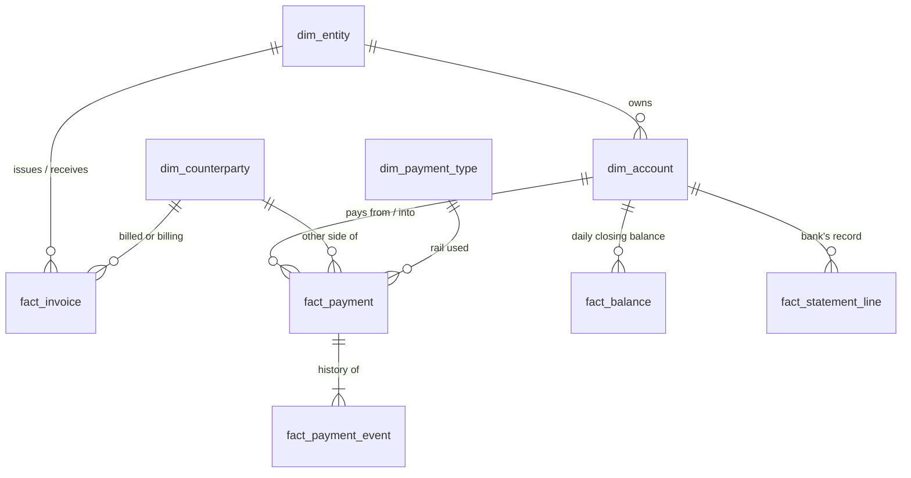

# Treasury Payments Analytics Platform

A portfolio project to learn, by building, what it is like to work in a Global Payments
Solutions environment. It simulates the payments of a fictional multinational group, then builds
a warehouse, nine treasury analyses, dashboards and a bank-style API on top of it.

> **All data is synthetic.** Entities, banks, BICs, counterparties and names are
> generated. No real client or employer data is used.

## The dataset at a glance

Picture one fictional company, **Group Treasury HQ in Singapore**, that owns ten other companies
around the world. Every day those companies pay suppliers, get paid by customers, run payroll and
move cash between themselves. The dataset is the record of all of that over 24 months: about
**106,000 payments**, worth roughly **S$2.6 billion**.

| Term | Plain meaning | Example from the data |
|---|---|---|
| **11 entities** | The separate legal companies inside the group. Each has its own bank accounts, home currency and local rules. One (the HQ) also acts as the group's *in-house bank*, lending cash to the others. | `E03` **Shanghai Mfg**, a factory in China that earns and pays in yuan (CNY), and `E06` **Germany GmbH**, which pays in euros. |
| **About 50 accounts** (48) | Bank accounts held by those entities at fictional banks. Each has a currency, a target balance the treasury wants to keep, and sometimes an overdraft limit. Some are *pooled*: any surplus is swept to a header account every night. | `A004` is SG Operations' main SGD account at *Merlion Global Bank* (a made-up bank). |
| **6 currencies** | SGD, USD, EUR, GBP, CNY, INR. The group reports in SGD, so every payment also carries its SGD value. CNY and INR are *restricted*: cash can't move freely in or out of China and India. | A payment of 10,739.70 GBP is stored as S$18,108.73 at that day's exchange rate. |
| **Payment rails** | The "roads" money travels on. Which road you use decides how fast it arrives, what it costs and how often it fails. | See the three types below. |

**Domestic rails** move money *within one country or region*. They are cheap and reliable, but many
run in batches with a daily **cut-off time**: miss it and the payment waits until the next business day.
Examples: `GIRO` (Singapore, next day), `ACH` (US), `SEPA_CT` (Europe), `BACS` (UK), `NEFT` (India), `CNAPS` (China).

**Instant rails** settle in seconds, at any hour, but usually cap the amount.
Examples: `FAST` (Singapore, up to S$200,000), `SEPA_INST` (Europe).

**Cross-border rails** move money *between countries*, usually through `SWIFT`, where the payment
hops across one or more **correspondent banks**. It is slower, each hop can take a fee, and it fails
the most (about 3% vs under 1% for domestic). Example, from the `fact_payment` and `fact_payment_event` tables:

> Payment `P00008587`: SG Operations (Singapore) pays a UK supplier £10,739.70 over SWIFT. Created
> 01:09, approved, sent to the bank at 01:27, screened for sanctions, then three hops between banks,
> and settled at 02:29 UTC. Every one of those steps is a row in the event table.

Two more, for completeness: `CARD` (corporate card spend, settles in about 2 days) and
`BOOK_TRANSFER` (between accounts at the same bank, instant).

**How the core tables connect.** Each of our companies owns accounts. Every payment runs between
one of our accounts and a counterparty, and it carries a step-by-step event history. Invoices say
what *should* be paid, payments say what *was* paid, and bank statements are the bank's own record.
Linking those three is the reconciliation problem, so there is deliberately no direct join between them.



The full diagram, with key columns and the reasoning behind each link, is in
[docs/data-model.md](docs/data-model.md).

**Preview the data without running anything:** see the [dataset card](docs/dataset/dataset-card.md)
(summary statistics, every column explained, one example record per table) and the
[sample CSVs](docs/dataset/samples/), which GitHub shows as tables.

## Why this project exists

I wanted hands-on practice with the problems a payments and treasury team deals with every
day: where money moves, why payments fail, how fast they settle, where cash sits idle, how
FX exposure builds up, and which transactions look wrong.

**The problem: there is no public dataset that fits.** Real payment data is confidential,
and the public datasets I found don't cover what I need (for example, PaySim and
credit-card fraud sets have fraud labels but no rails, cut-offs, correspondent hops,
bank statements, balances or intercompany flows). What I need is a linked set of payment
lifecycle events, bank statements, ledger balances, invoices and FX, with known answers to
check my analysis against.

**So I built the data first.** The simulator models how the business works (invoices,
payroll, tax, intercompany funding), pushes that through payment rails with realistic
timing, cut-offs, failures and fees, and posts it to a ledger. Then it deliberately plants
the patterns each analysis should find (a slow corridor, a legacy-file channel with worse
straight-through processing, repeat-offender suppliers, an entity that drains into
overdraft while another sits on idle cash) and records the ground truth separately in
`data/truth/`. Data-quality defects go only into the raw landing layer, so the cleaning
pipeline has real work to do. That gives me an answer key: I can check whether my SQL and
models find what I planted.

## Documentation trail

This repo is documented as I go, so the reasoning is visible, not just the result.

- [docs/journal/](docs/journal/) has dated entries: what I did, why, what went wrong, what I changed.
- [docs/data-model.md](docs/data-model.md) is the ER diagram: how the tables join, and which links are missing on purpose.
- [docs/dataset-design-review.md](docs/dataset-design-review.md) maps each analysis to the fields it needs.
- [docs/architecture.md](docs/architecture.md) describes the system design.
- Commit history is kept small and descriptive, one step per commit.

## Quick start

```bash
python3 -m venv .venv && source .venv/bin/activate
pip install -e ".[dev,api]"

# Small profile (recommended): ~106k payments, builds in ~20s, CSV/Excel friendly
treasury-sim --config config/simulation.small.yaml backfill
# ...also writes data_small/exports/treasury_dataset.xlsx (one sheet per table) and csv/,
# and refreshes docs/dataset/. Both rebuild automatically after every backfill and while streaming.
treasury-sim --config config/simulation.small.yaml export-all    # rebuild the exports on demand

# Full profile: ~850k payments, ~2 min
treasury-sim backfill             # 24 months of history -> data/warehouse/treasury.sqlite
treasury-sim stream --days 7      # then keep going live: 5 simulated minutes per real second
treasury-sim export-camt053 --account A001 --date 2026-09-15   # ISO 20022 bank statement XML
pytest                            # add -m "not contract" to skip the ~1 min full-size data checks
```

## Layout

| Path | Part | What |
|---|---|---|
| `config/simulation.yaml` | 1 | Every simulation parameter (full profile). Change a number, change the story. |
| `config/simulation.small.yaml` | 1 | Small profile (~1/8 volume) for browsing and CSV export |
| `src/treasury/simulator/` | 1a | Event-driven generator (world, FX, business events, lifecycle, ledger, recon, injectors) |
| `src/treasury/pipeline/` | 1b | Raw landing → DQ checks → clean → warehouse |
| `sql/schema/` | 2 | Star schema (SQLite / Postgres) |
| `sql/exploration/` | – | Ad-hoc queries for getting to know the data (start with `00_first_look.sql`) |
| `sql/analyses/` | 2 | One query file per analysis (01–09) |
| `src/treasury/analytics/` | 2/3 | Forecasting (5) and anomaly models (9) |
| `dashboards/` | 3 | BI files and screenshots |
| `src/treasury/api/` | 4 | FastAPI: balances, payment status, KPIs, forecast, exceptions |
| `docs/` | – | Architecture and the dataset design review |
| `docs/dataset/` | – | Dataset card and sample CSVs, auto-generated and committed so GitHub can preview the data |
| `data/`, `data_small/` | – | Generated output (git-ignored, reproducible from seed): `warehouse/`, `landing/` (monthly Parquet), `truth/` (hidden answers), `exports/` (Excel workbook + CSVs, small profile) |

## The nine analyses

1. Money movement · 2. Cross-border · 3. Payment efficiency · 4. Failures ·
5. Liquidity forecast · 6. Cash concentration · 7. FX exposure · 8. Reconciliation ·
9. Anomaly detection

See [docs/dataset-design-review.md](docs/dataset-design-review.md) for how the data
guarantees each analysis has something to find.

## Status

- [x] Repo, config schema, star schema DDL
- [x] World builder, per-country calendar, FX engine (`treasury-sim build-world`)
- [x] v1: business events, invoices and simple lifecycle → Parquet landing + warehouse (`treasury-sim backfill`)
- [x] v2: lifecycle event trail, ledger (AM04, funding, concentration, ZBA sweeps), daily balances
- [x] v3: live stream on a simulated clock (warehouse upserts, Parquet micro-batches, webhooks)
- [x] v4: labelled anomalies, DQ defects in raw files, bank statements, hedges, multi-invoice/short payments, camt.053 XML
- [ ] Part 1b cleaning pipeline · Part 2 SQL analyses · Part 3 dashboards · Part 4 API

## What's in the data

| Table | Small profile | Full profile | Notes |
|---|---|---|---|
| `fact_payment` | ~106k | ~850k | current state per payment (both legs for intercompany) |
| `fact_payment_event` | ~447k | ~3.5M | CREATED → … → SETTLED / REJECTED / RETURNED, with gpi hops |
| `fact_invoice` | ~69k | ~576k | AR/AP: paid, part_paid, open, written_off |
| `fact_statement_line` | ~148k | ~1.2M | the bank's view (camt.053): truncated refs, charges lines |
| `fact_balance` | 35k | 36.5k | closing balance per account per day |
| `fact_sweep` | ~6k | ~6k | nightly ZBA and same-entity funding transfers |
| `fact_fx_hedge` | ~470 | ~1k | monthly forwards against last month's exposure |
| `fact_fx_rate` | ~4.9k | ~4.9k | daily fixings to SGD |

The small profile keeps the same 24 months, entities, currencies and planted patterns, and
passes the same nine analysis checks.
