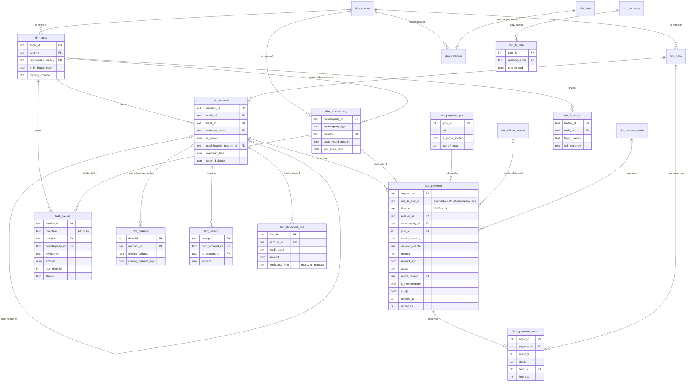

# Data model

How the warehouse tables (`data_small/warehouse/treasury.sqlite`) fit together. The source of
truth is the DDL in [`sql/schema/`](../sql/schema/); this page is the picture of it.

It is a **star schema**:

- `dim_*` tables describe *things*: companies, accounts, banks, counterparties. They change rarely.
- `fact_*` tables record *what happened*: payments, balances, invoices. They grow every day.

Every `*_date_id` column (yyyymmdd) joins to `dim_date`, and every `currency_code` joins to
`dim_currency`. Those two links are left out of the diagram, because drawing them from every
table makes it unreadable.

## Full diagram

## How to read it

**Follow a payment outward.** A row in `fact_payment` is one payment's *current state*.
From there:

1. `account_id` → `dim_account` → `dim_entity`: *which of our companies* paid or received.
2. `counterparty_id` → `dim_counterparty`: *who* was on the other side.
3. `type_id` → `dim_payment_type`: *which rail* it used (SWIFT, GIRO, SEPA…).
4. `payment_id` → `fact_payment_event`: *everything that happened to it*, one row per step
   (CREATED → APPROVED → SUBMITTED → … → SETTLED).

**Payments are one row per side we own.** `direction = 'OUT'` means money left one of our
accounts; `'IN'` means it arrived in one. An *intercompany* transfer (group company to group
company) touches two of our accounts, so it appears **twice**: an OUT leg and an IN leg,
sharing one `end_to_end_id`. Filter `is_intercompany = 0` for group totals, or every internal
transfer is counted twice.

**Balances are a daily snapshot.** `fact_balance` has one row per account per day, which is
what the forecast (analysis 5) and cash concentration (analysis 6) use.

## The links that are missing on purpose

Two joins you might expect **do not exist**, because finding them is the analysis:

| Missing link | Why | Where the answer key is |
|---|---|---|
| payment → invoice | In real life a receipt arrives with a reference like `INV-2291` (or a typo, or nothing), and treasury has to work out which invoice it pays. That's **reconciliation** (analysis 8). | `data_small/truth/payment_invoice.parquet` |
| statement line → payment | The bank's statement is a separate record of the same money. Matching it back to our payments is also analysis 8. | `data_small/truth/statement_payment.parquet` |

The `truth/` files are the answer key: never join them into analysis queries, only use them to
*score* your results afterwards.

## Try it

Open the database in [DBeaver](https://dbeaver.io/) (New Connection → SQLite → point it at
`data_small/warehouse/treasury.sqlite`) and run
[`sql/exploration/00_first_look.sql`](../sql/exploration/00_first_look.sql). Each query
there walks one part of this diagram.
